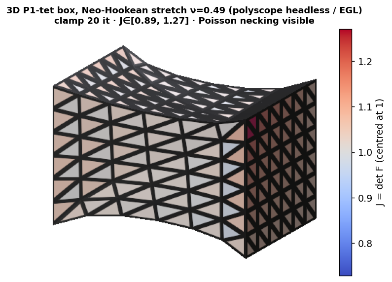

# Mesh-Elasticity Solver Survey & Benchmark

> Untangling a decade of numerical-method claims for **mesh elasticity** problems —
> distortion/parametrization optimization, projected-Newton eigenvalue filtering, and
> IPC-style contact — mostly from the SIGGRAPH literature (~2010–2025), placed against the
> classical optimization, computational-mechanics, and ML-optimizer canon.

**Status:** 🚧 **Design complete (P0); prototype harness running with measured results (P1).**
Full *survey design*, *annotated corpus*, *taxonomy*, *metric*/*protocol* specs, *harness
architecture*, and a *superiority-claims graph* (81 nodes, 160 edges) — plus a runnable
conformance-gated [`bench/`](bench/) harness covering **all six taxonomy axes** and **30 measured experiments** ([`results/`](results/)) with **19 deterministic figures** ([`figures/`](figures/)). See [Status & roadmap](#status--roadmap).

> **🔑 Worked example — the benchmark disentangling a live claim (2D, indicative).** A recent
> SIGGRAPH paper claims *absolute* eigenvalue filtering beats *clamping* near incompressibility.
> On standard P1 constant-strain elements our harness finds the **opposite** (absolute is slower
> and *fails* at ν=0.4999) — but that's a **volumetric-locking artifact of the element**. The
> honest test has to remove **two** confounds at once: use a locking-relieved element **and** the
> energy the paper is actually built on. With **both** removed — P2 element **+** Stable
> Neo-Hookean — absolute **beats** clamp near incompressibility (**38 vs 48 it at ν=0.4999**,
> [`results/p2_stable_nu.md`](results/p2_stable_nu.md)): the claim reproduces once the discretization
> and energy confounds are controlled. Getting there took three rounds of adversarial review to
> catch that the earlier "P2 win" was on the *wrong* energy. *(Scope: 2D, single stretch/seed/τ; P2
> only relieves locking — a fully locking-free Taylor–Hood element is the pending gold-standard
> control, so this is indicative, not a general proof.)*

---

## The one-paragraph pitch

Nearly every "faster / more robust elastic solver" paper is a **component swap** inside one
shared problem — minimize a nonlinear elastic energy `E(x) = Σ_e V_e ψ(F_e(x))` over mesh
vertex positions — yet papers typically change **2–3 things at once and credit one**. This
project builds (a) a defensible **taxonomy**, (b) a **superiority-claims graph** that records
who claims to beat whom and whether that claim is *validated / qualified / unvalidated /
refuted*, and (c) a **component-factored benchmark** that pins the confounds and measures
honest attribution.

## The unifying view

Every method here — graphics, classical, or ML — is **metric descent**

```
x' = x − α · M⁻¹ ∇E(x)
```

differing only in the metric `M` (and its globalization):

| `M` | method |
|---|---|
| `I` | gradient descent |
| `∇²E` | Newton |
| Fisher | natural gradient (Amari) — *undefined here: no output distribution* |
| Laplacian / H¹ | Sobolev gradient — **AQP, BCQN** |
| Killing operator | **AKVF** |
| reweighted energy | **SLIM** (IRLS Gauss-Newton) |

This lets us say precisely: "Sobolev preconditioning in graphics" and "natural gradient in ML"
are the *same idea under different metrics*.

**Honest boundary of the template (review-r2):** this single-global-step form does *not* cover
**block-coordinate / Gauss-Seidel** methods — **Vertex Block Descent (VBD)**, **JGS2**, PBNG — whose
update sweeps per-vertex local solves in a colouring-dependent order and is therefore *not*
`x − αM⁻¹∇E(x)` for any fixed `M` (the effective operator is triangular/sweep-dependent). Those live
in a separate "relaxation / coordinate-descent" family; the unifying claim is scoped to methods that
take one global step.

## The three "worlds" (comparability is governed by problem class, not method)

- **World 1 — static distortion / parametrization** (no inertia, no contact). AQP, SLIM,
  BCQN, Composite Majorization, TLC, GOSS.
- **World 2 — quasistatic/dynamic hyperelasticity** (inertia, no contact). The
  eigenvalue-filtering cohort, L-BFGS QN, ADMM, Vertex Block Descent.
- **World 3 — contact-coupled dynamics** (barriers, CCD, friction). IPC, ABD, GIPC, OGC.

Worlds 1–2 share the whole projected-Newton skeleton; World 3 adds four parameters that
belong to no solver (barrier stiffness `d̂`, CCD tolerance, friction `ε_v`, time-step `Δt`).

## Benchmark design in one picture

```
taxonomy → capability cells → tiered problem classes
  → within-cell FAIR head-to-head (fixed energy + criterion, single-axis ablation)
  → cross-cell performance profiles (Dolan–Moré) for robustness
  → equal tuning budget, standardized harness, hidden/rotating tier
```

- **v1** = contact-free **solver track**: *1a* distortion accelerators + *1b* eigenvalue-filter
  ablation on one projected-Newton skeleton. Delivered as a survey+benchmark paper, architected
  toward a living benchmark.
- **v2** = **contact capability track** + optional **learned-accelerators** companion track.

---

## Figures

Deterministic, regenerable (`python -m bench.run_figures`); full index + captions in
[`figures/README.md`](figures/README.md). A few headliners:

| | |
|---|---|
| [](figures/locking_p1_p2_sri.png) | **The confound, visual.** Near-incompressible stretch coloured by J=det F: P1 buckles into spurious modes (volumetric locking, 130 it); P2/SRI-P2 deform smoothly (26/66 it). Why the absolute-vs-clamp verdict flips between elements. |
| [](figures/claims_ledger.png) | **The epistemic scoreboard.** Of 160 extracted superiority-edges, 115 are the papers' own word and only 2 are independently validated here — the benchmark *qualifies* rather than overturns. |
| [](figures/mesh_independence.png) | **Rigor.** AQP's "mesh-independence" is tolerance-dependent — flat growth exponent at loose τ (p≈0), clearly growing at tight τ (p=+0.68±0.11). |
| [](figures/tet3d_stretch_J.png) | **3D, polyscope headless (EGL).** A P1-tet box stretched near-incompressibly; the 2D locking story confirmed in genuine 3D. |

---

## Repository map

| Path | What |
|---|---|
| [`docs/design.md`](docs/design.md) | Full design: scope arguments, recommended two-track benchmark, v1 plan, decomposition experiments, lineage map, scope ledger |
| [`docs/taxonomy.md`](docs/taxonomy.md) | The taxonomy: method axes × capability cells, classification of the corpus, orthogonality evaluation, fairness gate |
| [`docs/metrics.md`](docs/metrics.md) | Performance-metric deliberation: over-complete 80-metric catalog → per-cell orthogonal core; HW-dependent/independent pairing; data-profile aggregation |
| [`docs/harness.md`](docs/harness.md) | Harness architecture: component-slot contracts, config-as-point-in-component-space, conformance-suite admissibility gate, official-code-first mapping, scenario layer |
| [`docs/protocol.md`](docs/protocol.md) | Frozen v1 protocol: problem-set strata (1a/1b), controls C1/C2, reference-solution protocol, equal-budget/no-tuning rules, tiers |
| [`docs/experiments.md`](docs/experiments.md) | The five decomposition experiments (E1–E5) as config-diffs, each linked to the claims edges it hardens |
| [`docs/paper-outline.md`](docs/paper-outline.md) | STAR-style survey+benchmark paper structure and figure plan |
| [`docs/corpus.md`](docs/corpus.md) | Annotated corpus (~180 entries) across Worlds 0–3, with axis tags, comparability notes, code availability |
| [`claims/`](claims/) | **Superiority-claims graph** — machine-readable edges (`claims.yaml`) + rendered Mermaid graph ([`claims/README.md`](claims/README.md)) + [`schema`](claims/schema.md) + [hardening ledger](claims/hardening.md) |
| [`bench/`](bench/) | Prototype **component-factored harness** (Python/NumPy): energy/filter/direction/line-search/solver/criterion slots, conformance-gated |
| [`results/`](results/) | **Measured** decomposition-experiment outputs (E1, E1ν, data profiles, E4, E5, 1b dynamic, locking) — see [`results/README.md`](results/README.md) |
| [`CONTRIBUTING.md`](CONTRIBUTING.md) | Conventions for **humans and agents** adding papers, claims, and findings |

## The superiority-claims graph

A directed graph where **nodes = papers/methods** and **edges = "A claims superiority over B"**,
each edge annotated with the *dimension* of the claim (speed / robustness / convergence /
quality / generality), the *evidence* offered, and a *validation status*:

- `self-claimed` — asserted by the authors, not independently checked here
- `validated` — reproduced/confirmed (by an independent study or our benchmark)
- `qualified` — true only under stated conditions (regime, energy, mesh, metric)
- `unvalidated` — no sufficient evidence either way
- `refuted` — contradicted by evidence

The endgame: **harden** self-claims into validated / qualified / refuted as the benchmark
produces data. See [`claims/README.md`](claims/README.md).

## How this is built

Progress is tracked in **GitHub issues**; commits reference the issue they address. Today,
research and extraction are done by a mix of human curation and **LLM agents** (corpus breadth
+ claim extraction). The benchmark harness is a **common framework of hot-swappable
components**; components are reimplemented **from official code where it exists** and
**regression-tested against that official reference (or an independent oracle)** — and will
increasingly be **agent-generated** under that same rule. The invariant: benchmark numbers are
always *measured against a validated implementation*, never asserted by a model. See
[`CONTRIBUTING.md`](CONTRIBUTING.md).

## Status & roadmap

Tracked in [GitHub issues](../../issues). Phases follow `docs/design.md` §11.

| phase | what | state |
|---|---|---|
| **P0 — design & curation** | taxonomy, corpus, metrics, harness architecture, protocol freeze, experiment specs, claims graph | ✅ **complete** (this repo) |
| **P1 — harness + 1b** | build the component framework; port official code + conformance tests; run the decomposition experiments | 🟢 **substantially done** — [`bench/`](bench/) covers **all six axes** (energies: sym-Dirichlet, Neo-Hookean 2D/**3D-tet**; directions: Newton, trust-region, L-BFGS, **AQP**, **Sobolev-L-BFGS**, **local-global**, **Anderson**, GD, Adam; **7 filters** incl. trust-region; line-search; 4 linear solvers incl. sparse + Jacobi-PCG; **P2** + **3D-tet** elements; **barrier-aware line-search**; **untangling area-penalty**) with **30 measured experiments** and an **official-code energy cross-check vs libigl SLIM** (sym-Dirichlet, one mesh — not a ported-component regression). Claims graph hardened: **2 validated, 23 qualified** (+22 World-3 edges marked `unmeasured` — v1 measures no contact). |
| **P2 — 1a + feasibility** | distortion accelerators + injectivity suites; BCQN triple-split (E3); full performance profiles | 🟡 **started** — **E3** two of BCQN's three factors now isolated: the **barrier-aware line-search** (new conformance-gated component `bench/barrier_ls.py`; `results/e3.md` — a *modest*, energy-eval-only effect, redundant with symmetric-Dirichlet's own barrier, **not** Fig.6's >10×) and the Sobolev-proxy direction (`world1_profiles.md`); Dolan–Moré/data **profiles** rendered (`figures/profiles.png`); the **twist-eigenvalue analysis** (`results/twist_analysis.md`) pins the clamp-vs-absolute-vs-CM question to one analytic scalar. Remaining: characteristic-gradient criterion + full 2³, injectivity suite, faithful CM (#14). |
| **P3 — paper + release** | write the STAR; release harness as living-benchmark seed (closed/open divisions, hidden tier) | ⬜ |
| **v2 — contact + learned** | Track-2 contact via the scenario layer; learned-accelerator companion track | ⬜ |

Open issues map to remaining P0 tails (consolidated taxonomy table #1, per-stratum mesh curation
#2, concrete slot signatures #3, claims long-tail #4) and to P1+ execution (claim hardening #5,
experiment runs #7, paper draft #8). Decisions resolved: D1 (paper→living-benchmark, phased),
D2 (full 1a+1b spine), D3 (official-code-first, regression-tested harness), D4 (contact→v2).

## Caveats

Corpus entries carry `[?]` uncertainty flags where a detail (venue, code release, exact
method) was not independently verified. Some 2025–2026 arXiv items are unconfirmed. Claims are
recorded as *authors' assertions* until marked otherwise — inclusion is not endorsement.
