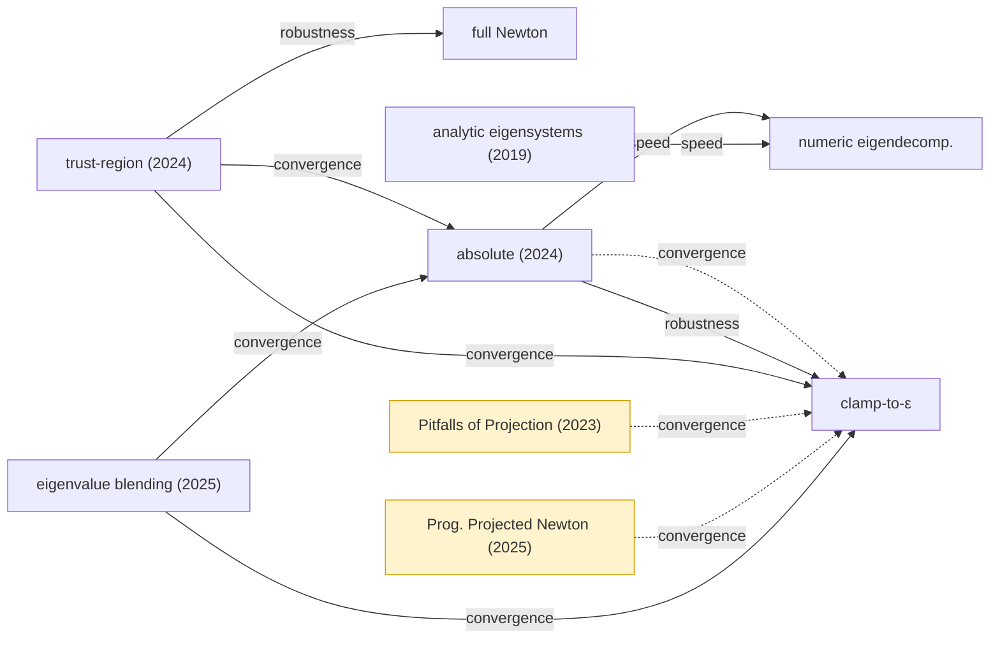
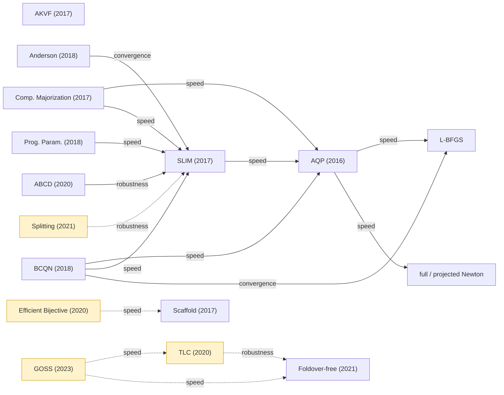
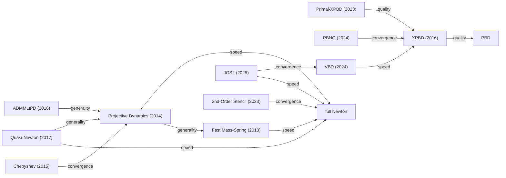
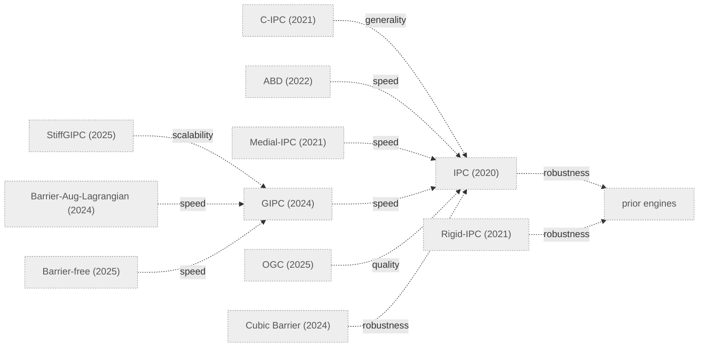

# Superiority-Claims Graph

Directed graph: **nodes = methods/papers**, **edges = "A claims to beat B"** on some
dimension. Each edge is *hardened* from `self-claimed` toward `validated` / `qualified` /
`refuted` as evidence accrues. Machine-readable source of truth: [`claims.yaml`](claims.yaml)
(81 nodes, 160 edges) · Schema: [`schema.md`](schema.md).

> Built by per-paper self-claim extraction (issue #4), 5 agent batches over the corpus.
> **Inclusion ≠ endorsement** — an edge records the *authors' assertion* until independently
> assessed. The diagrams below are **curated subsets** for readability; the complete edge set
> lives in `claims.yaml`.

## Stats

- **160 edges**, **81 nodes**. Status: **115 self-claimed**, **19 qualified**, **4 validated**, **22 unmeasured**, 0 refuted — being hardened by the benchmark (`bench/`, `results/`).
- The **22 `unmeasured`** edges are *all* of World 3 (contact): decision **D4 defers contact to v2**, so v1 makes **no measured contact claim**. They are shown below for completeness but are the papers' own assertions, not benchmark results (machine-readable rule: an edge is `unmeasured` iff either endpoint has `world: 3`). See [`schema.md`](schema.md).

**Benchmark-hardened so far** (`assessed_by: benchmark`; see [`hardening.md`](hardening.md)):
- `anderson-geometry → local-global` — **validated** (Anderson 12 it vs local-global 23 it on a non-trivial sheared-target ARAP, mesh-independent, same minimum; reproducible `python -m bench.run_anderson`, `results/anderson.md`; wall-clock reported alongside — a smaller speedup than the iteration ratio).
- `absolute-filtering → clamp-filtering` — **qualified/settled**: P1 "refutation" is a locking artifact; on the P2 element absolute matches/beats clamp (`results/p2_nu.md`).
- `trust-region-filtering → {clamp, absolute}` — **validated**: the faithful three-state blend λ_eff=(1−w)λ+w|λ| (which reproduces full-Newton/clamp/absolute exactly, conformance-gated) beats **both** filters on **both** P1 (139 vs 242/maxiter) and P2 (39 vs 53/41); restoring the w=0 full-Newton branch is what wins on locking P1 (`results/world2_filters.md`).
- `slim → aqp` — **validated (HW-independent)**: official libigl SLIM 5 it vs AQP 19 (soft-constraint drift 4e-16 clears the confound); wall-clock is C++/Python-confounded so counts carry it (`results/slim.md`).
- `pitfalls-projection → clamp-filtering` — **affine-invariance sub-claim validated**: unfiltered Newton is affine-covariant to 3e-13 under coordinate rescaling; clamp/absolute/global-PDN all break it (60.8/0.21/60.8) — a claim iteration-count can't test (`results/pitfalls.md`).
- `aqp → l-bfgs` — **qualified/unreproduced**: AQP loses to a well-implemented L-BFGS; the ×200 was a MATLAB-baseline confound (`results/e2.md`).
- `sobolev-lbfgs → l-bfgs` — **qualified**: the *isolated* Sobolev-preconditioning component (D0=L⁻¹, one of BCQN's three) helps only in the ill-conditioned regime (34 vs 55 it), not the well-conditioned one (`results/e2.md`). `bcqn → l-bfgs` itself is **reverted to self-claimed** — the full blended method (barrier-aware line-search filter + blend + criterion) and its E3 factorial are unimplemented, so the measured win belongs to the component, not to BCQN.
- Dimensions: speed 55 · convergence 36 · robustness 35 · quality 13 · generality 10 · scalability 9 · simplicity 1.
- Most-targeted baselines: `full-newton` (13), `ipc` (11), `xpbd` (10), `slim` (9), `clamp-filtering` (7), `l-bfgs` (7).

## Legend

| status | meaning | render |
|---|---|---|
| `self-claimed` | authors assert it; not independently checked | solid grey |
| `qualified` | holds only under stated conditions / benchmark-backed pending re-run / independent study | amber, dashed |
| `validated` | reproduced/confirmed independently or by our benchmark | green |
| `refuted` | contradicted by evidence | red |
| `unmeasured` | out of v1 scope by construction (all World-3/contact edges; D4 defers to v2) — no measurement attempted | dotted grey |

Edge labels = the **dimension** of the claim.

## World 2 — eigenvalue-filtering axis (the v1 benchmark target)

*Amber/dashed = `qualified`. absolute→clamp is qualified (authors concede small-deformation
compression can slightly damp convergence). Pitfalls-of-Projection is an **independent** study →
it qualifies clamp's implicit convergence claim. PPN is fastest **except** very large steps /
quasistatics.*

## World 1 — distortion optimization

*BCQN's outgoing edges are **entangled** (it changes line search + proxy + convergence
criterion at once). Injectivity/feasibility edges (TLC, Foldover-free, GOSS, Efficient
Bijective) are `qualified` — backed by released benchmarks pending independent re-run.*

## World 2 — simulation accelerators / integrators

*Nested generality chain `fast-mass-spring ⊂ projective-dynamics ⊂ quasi-newton ⊂ admm-pd`.
Many "N× faster than Newton" edges here are **fixed-budget / per-iteration**, not converged
(flagged in each edge's `notes`). XPBD→PBD explicitly disclaims any speed win (consistency
only). Cleanest converged claims: JGS2→{VBD,PD,XPBD}, PBNG→XPBD, Primal-XPBD→XPBD.*

## World 3 — contact / IPC

> ⚠️ **Every edge in this World-3 diagram is `unmeasured`** (dotted): v1 benchmarks no contact
> (decision D4 → v2). These are the papers' self-claims, shown for map completeness only — **not**
> a measured contact leaderboard.
>
> Each World-3 edge also carries **`guarantee_preserved`** (`schema.md`): whether the source keeps
> IPC's intersection/inversion-free guarantee *by construction*. **15 edges = `"yes"`** (IPC family,
> incl. ABD/Medial-IPC/cubic-barrier); **7 = `"approx"`** — they *change what is guaranteed*
> (`barrier-aug-lagrangian` ALM, `ogc` offset-geometry, `barrier-free-elastodynamics`). A speed win
> tagged `"approx"` is **not** a like-for-like beat of IPC: it also relaxed the guarantee. Those 7
> belong to a different capability cell, not the same leaderboard.

*Two comparison regimes: **fair** = same barrier / same GPU, vary the inner solve (GIPC's 3×
eigensystem, StiffGIPC & Barrier-Aug-Lagrangian vs GIPC). **Confounded / capability-only** =
GPU-vs-CPU (GIPC ~95×, Barrier-Aug-Lagrangian 80× vs CPU IPC), DOF/subspace reductions (ABD,
Medial-IPC), and contact-model swaps (OGC, Cubic Barrier, Barrier-free — binary non-penetration
demos, not shared-metric convergence). Barrier-free claims **parity** with IPC robustness, not
superiority. Every such caveat is in the edge `notes`.*

## Notable qualified / honest-caveat edges

These are the 16 `qualified` edges plus the author-conceded caveats — the seeds for hardening (#5):

| edge | why qualified / honest note |
|---|---|
| absolute → clamp (convergence) | authors concede small-deformation compression can slightly damp convergence; ν-edge may be locking-confounded (control C1) |
| Pitfalls-of-Projection → clamp | **independent** study: clamping degrades *asymptotic* rate; still robust far from solution |
| PPN → clamp (convergence) | fastest **except** very large steps / quasistatics |
| Splitting → {SLIM, AKVF, PP} | robust to flips but **not consistently faster**; can fail on far-constraint inits |
| TLC → {LBD, SA, FF} | backed by released 11,647-mesh benchmark, pending independent re-run; robustness axis only |
| Foldover-free → TLC | benchmark-backed; FF must switch L-BFGS→Newton for extreme rotations |
| GOSS → {TLC, FF} | benchmark-backed speed; success rate is *comparable*, not better |
| Efficient-Bijective → Scaffold | benchmark-backed ~6×; per-iteration cost, 2D disk-topology only |
| Rigid-IPC → prior engines | robustness guarantee but authors concede **2–3 orders slower** |
| XPBD → PBD | authors **disclaim** any speed/convergence win (consistency only) |

## How to extend

Add nodes/edges to [`claims.yaml`](claims.yaml) per [`schema.md`](schema.md); one edge =
one `(from, to, dimension)`; harden `status` in place with a cited `assessed_by`. Reflect
structural changes in the diagrams here. See issue #4 (extraction) and #5 (hardening).
