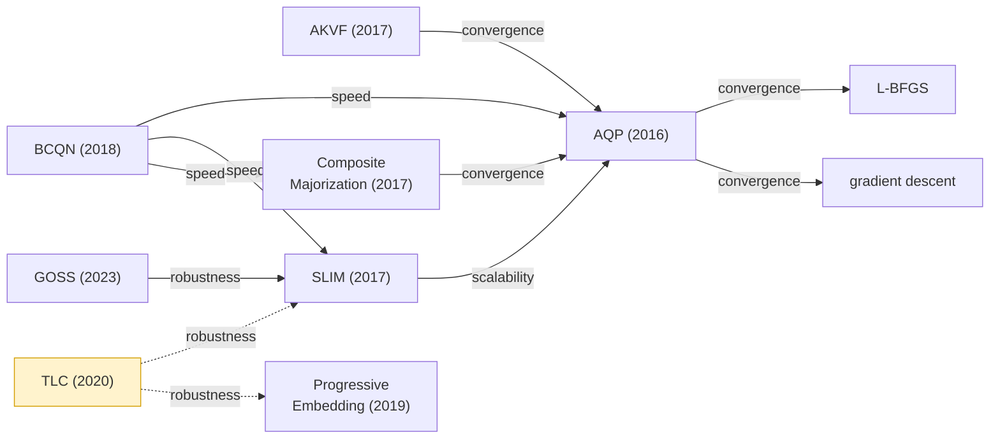

# Superiority-Claims Graph

Directed graph: **nodes = methods/papers**, **edges = "A claims to beat B"** on some
dimension. Each edge is *hardened* from `self-claimed` toward `validated` / `qualified` /
`refuted` as evidence accrues. Machine-readable source: [`claims.yaml`](claims.yaml) ·
Schema: [`schema.md`](schema.md).

> Status of this file: **seed set**, hand-authored from [`../docs/corpus.md`](../docs/corpus.md).
> Being expanded by per-paper self-claim extraction (issue #4). Inclusion ≠ endorsement; an
> edge records the *authors' assertion* until independently assessed.

## Legend

| status | meaning | render |
|---|---|---|
| `self-claimed` | authors assert it; not independently checked | ⚪ grey edge |
| `qualified` | holds only under stated conditions | 🟡 amber edge |
| `validated` | reproduced/confirmed independently or by our benchmark | 🟢 green edge |
| `refuted` | contradicted by evidence | 🔴 red edge |
| `unvalidated` | insufficient evidence either way | ⚫ dashed edge |

Edge labels = the **dimension** of the claim (speed / convergence / robustness / quality /
generality / scalability / simplicity).

## World 2 — eigenvalue-filtering axis

The cleanest cluster: every method plugs into the same projected-Newton skeleton and differs
only in the SPD-projection operator. This subgraph is the v1 benchmark's primary target.

```mermaid
flowchart LR
    clamp["clamp-to-ε<br/>(Teran '05 / analytic)"]
    full["full Newton"]
    abs["absolute filtering<br/>(2024)"]
    tr["trust-region filtering<br/>(2024)"]
    pit["Pitfalls of Projection<br/>(2023)"]
    ppn["Progressively Projected<br/>Newton (2025)"]
    blend["eigenvalue blending<br/>(2025)"]

    abs -->|convergence| clamp
    tr  -->|convergence| clamp
    tr  -->|convergence| abs
    tr  -->|robustness|  full
    pit -.->|convergence| clamp
    ppn -.->|convergence| clamp
    blend -->|convergence| clamp
    blend -->|convergence| abs

    classDef selfclaimed stroke:#888,color:#333;
    classDef qualified fill:#fff3cd,stroke:#d39e00;
    class pit,ppn qualified;
```

*(GitHub renders Mermaid natively. Amber nodes = they raise a `qualified` claim; dashed edges
= `qualified`. Pitfalls-of-Projection and PPN both qualify the clamp method's convergence:
clamping degrades asymptotic rate / is beaten when projection is done selectively, but remains
useful far from the solution and for very large steps.)*

## World 1 — distortion optimization



*(BCQN's three outgoing edges are all `self-claimed` and **entangled** — it changes line
search + proxy + convergence criterion at once; benchmark experiment #3 splits these. TLC's
edges are `qualified` because they rest on a released 11,647-mesh benchmark measuring
feasibility/success — a different axis from convergence speed — pending independent re-run.)*

## All edges (seed set)

| from | → to | dimension | status |
|---|---|---|---|
| absolute-filtering | clamp-filtering | convergence | self-claimed |
| trust-region-filtering | clamp-filtering | convergence | self-claimed |
| trust-region-filtering | absolute-filtering | convergence | self-claimed |
| trust-region-filtering | full-newton | robustness | self-claimed |
| pitfalls-projection | clamp-filtering | convergence | **qualified** |
| progressively-projected-newton | clamp-filtering | convergence | **qualified** |
| eigenvalue-blending | clamp-filtering | convergence | self-claimed |
| eigenvalue-blending | absolute-filtering | convergence | self-claimed |
| slim | aqp | scalability | self-claimed |
| aqp | l-bfgs | convergence | self-claimed |
| aqp | gradient-descent | convergence | self-claimed |
| bcqn | aqp | speed | self-claimed |
| bcqn | slim | speed | self-claimed |
| bcqn | composite-majorization | speed | self-claimed |
| composite-majorization | aqp | convergence | self-claimed |
| akvf | aqp | convergence | self-claimed |
| goss | slim | robustness | self-claimed |
| tlc | slim | robustness | **qualified** |
| tlc | progressive-embedding | robustness | **qualified** |
| quasi-newton-liu2017 | projective-dynamics | generality | self-claimed |
| anderson-geometry | local-global | convergence | self-claimed |
| vertex-block-descent | projective-dynamics | speed | self-claimed |
| vertex-block-descent | xpbd | convergence | self-claimed |

## How to extend

Add nodes/edges to [`claims.yaml`](claims.yaml) following [`schema.md`](schema.md), then update
the diagrams/table here (or regenerate). One edge = one `(from, to, dimension)`; harden
`status` in place with a cited `assessed_by`, don't duplicate. See issue #4 for the extraction
protocol and issue #5 for hardening against benchmark results.
