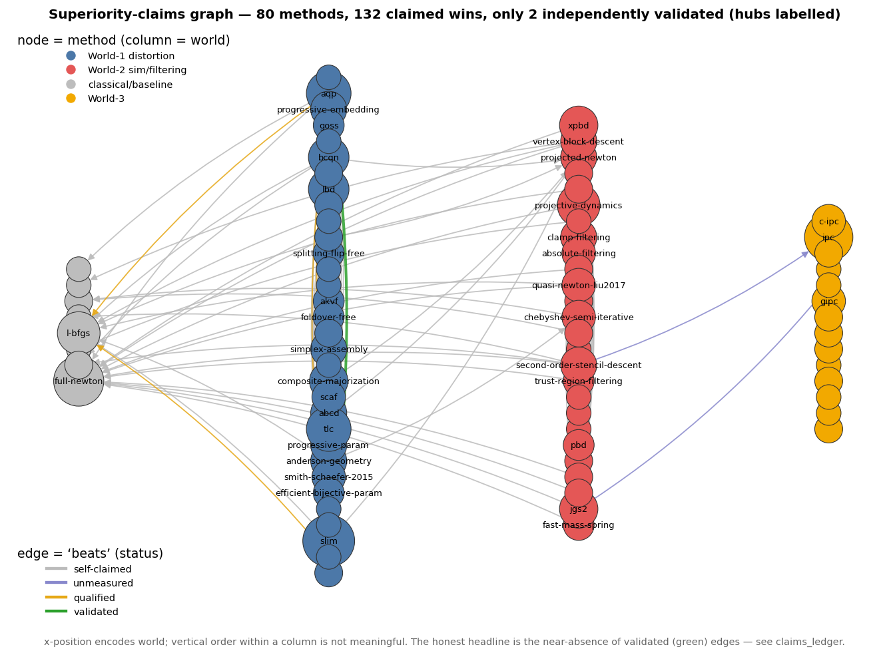
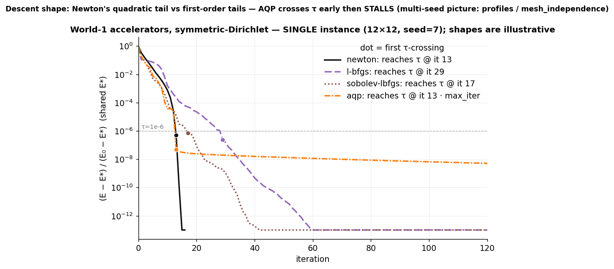
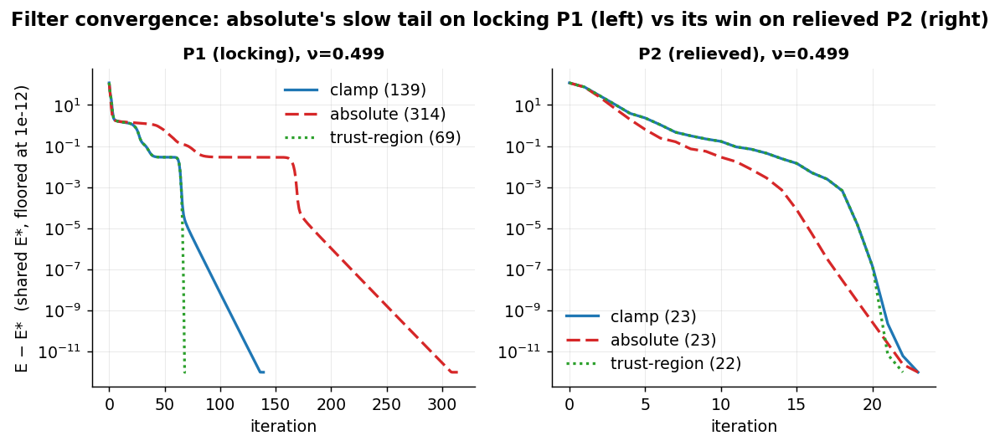
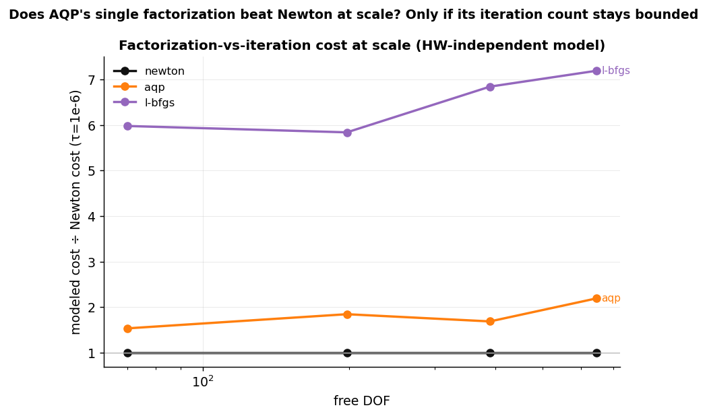
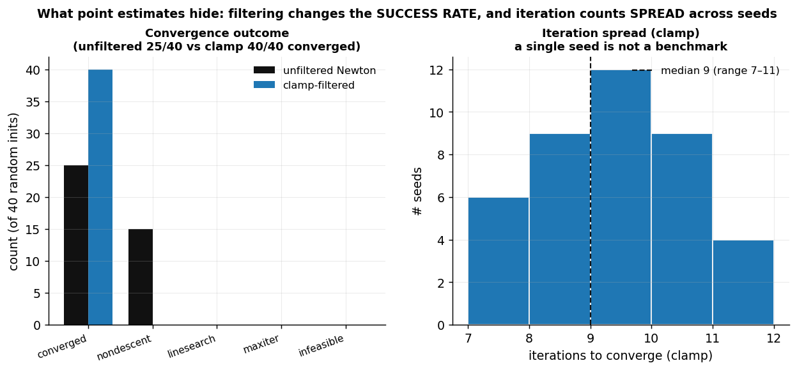

# Figures

Deterministic figures for the survey + benchmark. Regenerate all with `python -m bench.run_figures`,
or one at a time with `python -m bench.run_figures <name> [<name> ...]`. 2D meshes and every plot use
matplotlib (Agg); the genuine-3D example uses **polyscope headless (EGL)**. Committed as PNGs so the
repo renders on GitHub. Generators live in `bench/run_figures.py`; shared style/helpers in `bench/viz.py`.

Each figure is a view onto a claim the benchmark has *measured* — not a decoration. Where a verdict is
only "qualified" in `claims/claims.yaml`, the figure's caption says so.

## Survey / corpus (breadth)

| figure | shows |
|---|---|
|  `corpus_breadth` | Papers-per-year stacked by world + node totals — the corpus spans ~2003–2026 and **both** worlds, so no single paper or corner dominates. |
|  `claims_ledger` | The epistemic scoreboard: every extracted superiority-edge by status (self-claimed / unmeasured / qualified / validated). Most claims are the papers' own word; this benchmark *qualifies* rather than overturns. |
|  `claims_network` | The superiority-claims graph: nodes = methods (coloured by world), directed edges = "A claims to beat B" (coloured by evidentiary status). Hubs labelled. |

## World-1 (distortion optimization)

| figure | shows |
|---|---|
|  `accelerator_convergence` | Normalized energy-gap vs iteration for Newton / L-BFGS / Sobolev-L-BFGS / AQP on a perturbed grid (single seed, labelled). Newton's quadratic plunge vs the first-order tails; **AQP clears τ=1e-6 early then stalls** — the loose-vs-tight-τ story. |

## World-2 (simulation / eigenvalue filtering)

| figure | shows |
|---|---|
|  `locking_p1_p2_sri` | **The headline confound, visual.** Near-incompressible Neo-Hookean stretch coloured by J=det F (true range, centred at 1): **P1** buckles into spurious modes (volumetric locking, 130 it); **P2** / **SRI-P2** deform smoothly (26/66 it). The signature is the buckled geometry + iteration count, not a J excursion (P1's J range is no wider than P2's). This is *why* the absolute-vs-clamp verdict flips between elements. |
|  `filter_convergence` | Per-iteration energy gap for clamp / absolute / trust-region on locking **P1** vs relieved **P2**. Absolute drags a long plateau tail on P1 (314 it), trust-region backs off to Newton (69 it); on P2 all three finish in ~22 it and absolute is marginally best. |
|  `tet3d` | **Polyscope headless / EGL** render of a P1-tet box stretched at near-incompressible ν, coloured by per-tet J=det F — the 2D locking story confirmed in genuine 3D (Poisson necking visible). |

## Metrics rigor

| figure | shows |
|---|---|
|  `mesh_independence` | AQP & L-BFGS iterations vs DOF on log-log at loose vs tight τ, with min–max bands and the CI-gated growth exponent p (iters∝DOF^p). AQP's mesh-independence is **tolerance-dependent** — flat (p≈0) at loose τ, growing at tight τ. |
|  `profiles` | Dolan–Moré performance profile + a data profile over the multi-seed World-1 instance set — the cutoff-robust way to compare solvers (no single-τ total order). |
|  `scale_cost` | Modeled relative cost (Newton=1) vs DOF for Newton / AQP / L-BFGS, from measured iteration counts + the 2D sparse-Cholesky complexity model. Whether AQP's single factorization wins at scale depends on its iteration count staying bounded. |
|  `histograms` | Two distributions point-estimates hide: unfiltered-Newton **failure rate** vs clamp across random inits (why filtering exists), and per-seed **iteration spread** (a single seed is not a benchmark). |
