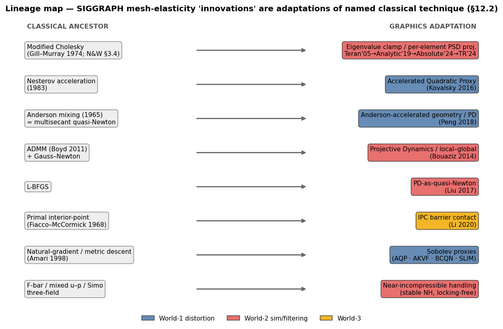
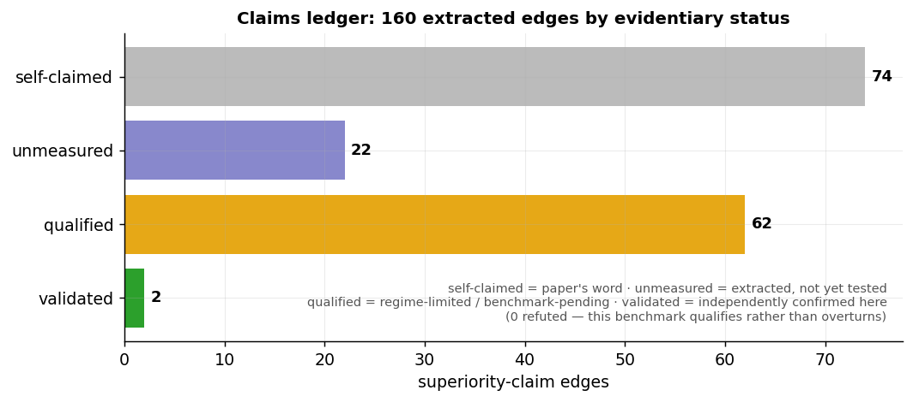
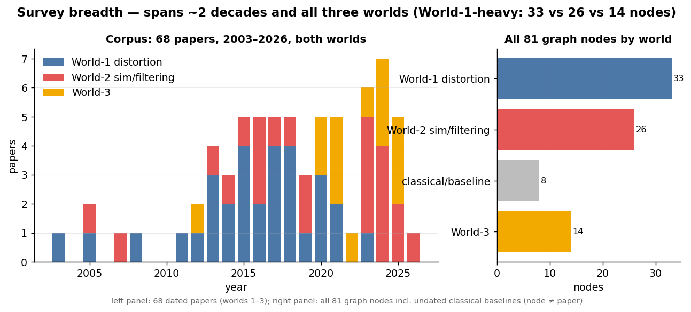
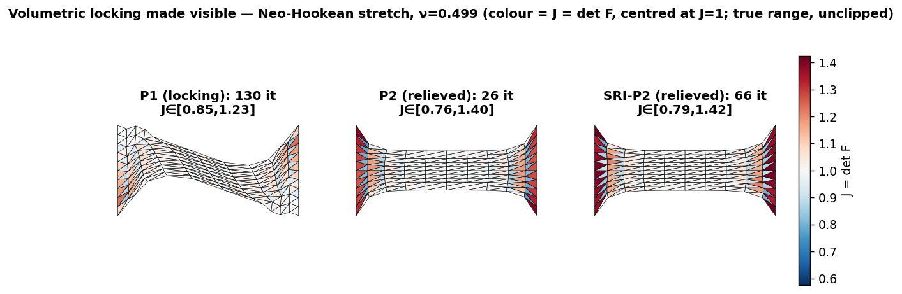
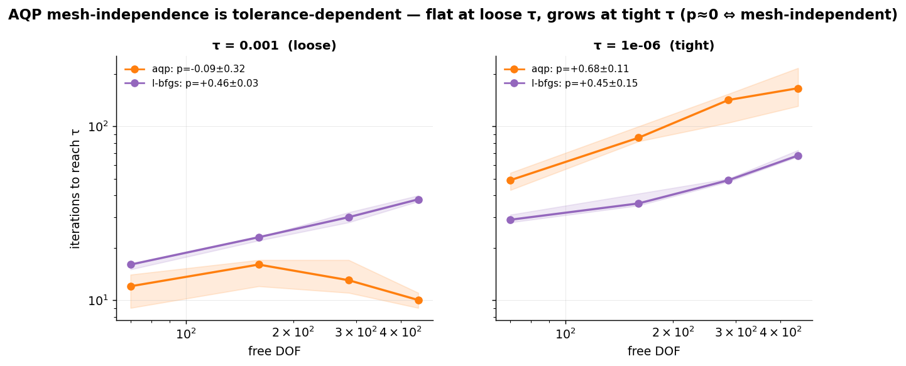
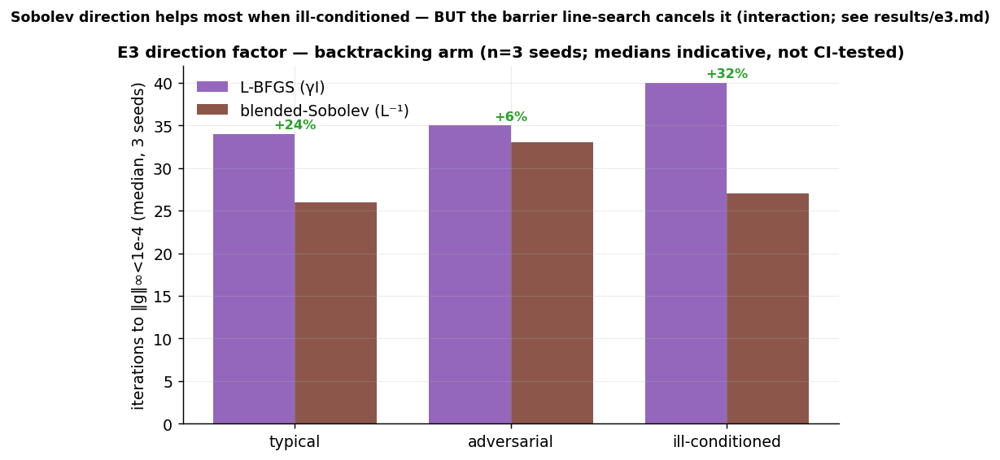
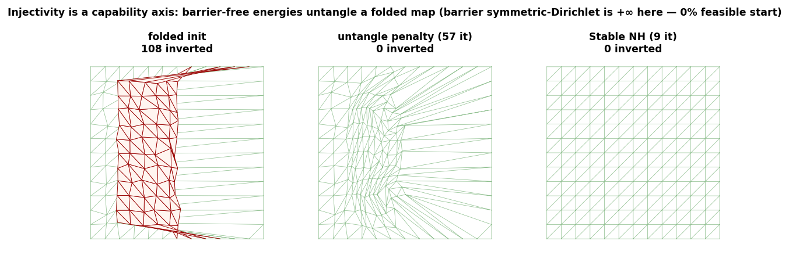
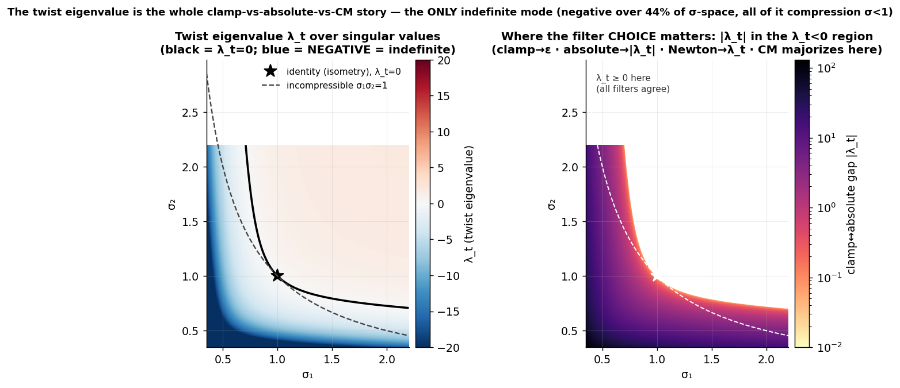

# Untangling a Decade of Mesh-Elasticity Solvers: A Component-Factored Survey and Benchmark

## Abstract

Over the past decade, computer graphics has produced a steady stream of "faster" and "more robust"
solvers for mesh-elasticity problems — parametrization and distortion optimization, projected-Newton
hyperelastic simulation, and contact-coupled dynamics. Yet nearly every such paper is a **component
swap inside one shared iteration**: minimize a nonlinear elastic energy over vertex positions by some
form of metric descent `x' = x − α M⁻¹ ∇E(x)`. Papers routinely change two or three components at
once — the energy, the Hessian filter, the search direction, the line search, the linear solver, the
convergence criterion — and credit a single one, making the literature's superiority claims difficult
to trust or reproduce.

This State-of-the-Art Report reorganizes the field around that shared structure and asks, component
by component, **which published superiority claims survive confound control**. We contribute (i) a
*unifying view* that casts graphics, classical-optimization, and machine-learning solvers as metric
descent under different choices of `M`; (ii) a six-axis *taxonomy* over three "worlds" (static
distortion, hyperelastic simulation, contact dynamics) that share machinery but not comparability;
(iii) a *lineage map* showing that many graphics "innovations" are adaptations of named classical
technique (eigenvalue filtering ⇐ modified Cholesky, accelerated quadratic proxy ⇐ Nesterov,
projective dynamics ⇐ ADMM, IPC ⇐ interior-point); (iv) a machine-readable *superiority-claims graph*
(81 methods, 160 claimed wins) recording who claims to beat whom with what evidence; and (v) a
*component-factored benchmark* — a conformance-gated harness in which a configuration is a point in
component space and each experiment changes exactly one axis.

Applied to the contact-free solver track (2D prototype), the benchmark's decomposition experiments
overturn, qualify, or contextualize several well-cited claims. Our headline case study — a recent
near-incompressibility filtering claim — *reverses* on standard constant-strain elements (the
filter's advantage becomes a failure — *a volumetric-locking artifact of the element, not a property
of the filter*) and then *re-validates* only once **two entangled confounds, the element and the
energy, are separately controlled**; four independent locking treatments concur.
We further find that a flagship quasi-Newton method's three components **entangle rather than add**,
that a proxy method's celebrated mesh-independence is a **loose-tolerance artifact**, and that the
entire clamp-versus-absolute filtering question reduces to **one analytic scalar** — the sole
sign-indefinite eigenmode of the element Hessian.

Of the 160 extracted superiority edges, only **2 are independently validated** and **62 qualified**
by our measurements; the rest remain the papers' own word pending faithful re-measurement. This is
the honest core: rather than a leaderboard, the benchmark and its **adversarial review loop** — in
which the harness's confound-untangling is applied reflexively to our *own* conclusions, forcing
repeated retractions — offer a reproducible *method for honest attribution*. We release the harness,
claims graph, and figures as the seed of a living benchmark.

**Scope.** The v1 measurements are a 2D prototype: dense solves, small meshes, indicative not
definitive. Every headline is reported with its regime of validity; the contact track and larger-scale
studies are future work. The contribution is the attribution *method* and the survey scaffolding, not
a settled ranking.

---

## Contents

- [1. Introduction](#1-introduction)
- [2. The Unifying View: Everything Is Metric Descent](#2-the-unifying-view-everything-is-metric-descent)
- [3. Taxonomy: Six Axes over Three Worlds](#3-taxonomy-six-axes-over-three-worlds)
- [4. Survey by Axis](#4-survey-by-axis)
- [5. Lineage Map: Graphics "Innovations" ⇐ Classical Ancestors](#5-lineage-map-graphics-innovations--classical-ancestors)
- [6. The Superiority-Claims Graph](#6-the-superiorityclaims-graph)
- [7. Benchmark Design](#7-benchmark-design)
- [8. Results: The Decomposition Experiments](#8-results-the-decomposition-experiments)
- [9. What Survived — and the Review Loop as Method](#9-what-survived--and-the-review-loop-as-method)
- [10. Open Problems and the Living Benchmark](#10-open-problems-and-the-living-benchmark)
- [References](#references)

---

# 1. Introduction

Simulating and optimizing the deformation of triangle and tetrahedral meshes is a workhorse of
computer graphics. The same mathematical object recurs across seemingly distinct subfields: given a
rest mesh and some boundary conditions, find vertex positions `x` that minimize a nonlinear elastic
energy

$$E(\mathbf{x}) = \sum_e V_e\, \psi\!\left(F_e(\mathbf{x})\right),$$

a sum over elements of a stored-energy density `ψ` of the per-element deformation gradient `F_e`.
UV parametrization minimizes a *distortion* energy (symmetric Dirichlet, MIPS, ARAP); flesh and cloth
simulation minimize a *hyperelastic* energy (Neo-Hookean, corotational) plus inertia; and
contact-rich animation adds barrier and friction terms. Across all of them the computational core is
the same: iteratively descend a nonconvex energy whose Hessian is indefinite far from the minimum.

**The entanglement problem.** A decade of papers has proposed "faster" or "more robust" solvers for
this core. Almost universally, a new method is a *component swap* inside one shared iteration — it
changes the energy, the way the indefinite Hessian is made positive-definite (the *filter*), the
search direction, the line search, the linear solver, or the convergence criterion. The difficulty is
that papers typically change **two or three of these components at once and attribute the resulting
speed-up or robustness to a single one**. A method might blend a new preconditioner *and* a new
line-search *and* a new stopping criterion, then report an order-of-magnitude win against a baseline
that shares none of them. The reader cannot tell how much of the advantage is the headline idea, how
much is the other bundled changes, and how much is a weak or mismatched baseline. Superiority claims
accumulate that are individually plausible and collectively irreconcilable.

**Two failure poles.** A survey of this literature can fail in two opposite ways. It can be *insular
and narrow* — comparing only within one clique of graphics papers, inheriting their baselines and
their confounds, and reproducing rather than testing their claims. Or it can be *broad and unfair* —
racing methods across problem classes they were never designed for, or against implementations of
wildly different maturity (a compiled C++ library versus a research prototype), so that hardware and
engineering masquerade as algorithm. A useful account must be broad enough to place graphics work
against its classical-optimization and computational-mechanics roots, yet disciplined enough to
compare only what is comparable, one component at a time.

**This report.** We reorganize the field around its shared structure and ask, component by component,
which published superiority claims survive confound control. Our contributions are:

- **A unifying view (§2).** Graphics, classical-optimization, and machine-learning solvers are all
  *metric descent* `x' = x − α M⁻¹ ∇E(x)`, differing only in the metric `M` and its globalization.
  This makes the swapped components explicit and lets us say precisely, for example, that "Sobolev
  preconditioning" in graphics and "natural gradient" in machine learning are the same idea under
  different metrics — with the honest caveats where the analogy breaks.

- **A taxonomy over three worlds (§3).** Six method axes (energy, filter, direction, line search,
  linear solver, criterion) crossed with problem-class *capability cells*, grouped into three worlds
  — static distortion, hyperelastic simulation, contact dynamics — that share machinery but not
  comparability. Comparability is governed by the problem class, not the method.

- **A survey by axis and a lineage map (§4–§5).** We organize the annotated corpus by *component*
  rather than chronology, and we trace each graphics "innovation" to its named classical ancestor:
  eigenvalue filtering to modified-Cholesky Hessian modification [cite:gill-murray-1974], the accelerated quadratic proxy to
  Nesterov acceleration [cite:nesterov-1983], projective dynamics to ADMM [cite:boyd-2011-admm], IPC [cite:ipc] barriers to primal interior-point methods [cite:fiacco-mccormick-1968].
  Cited as adaptations rather than inventions, the lineage points each method at the classical analysis
  that explains — and often anticipates — its measured behavior (§8).

- **A superiority-claims graph (§6).** A machine-readable directed graph — 81 methods, 160 claimed
  wins — recording who claims to beat whom, on what dimension, with what evidentiary status
  (self-claimed / qualified / validated). It exposes the recurring honesty patterns: fixed-budget
  versus converged comparisons, hardware confounds, entanglement, and the authors' own regime
  disclaimers.

- **A component-factored benchmark (§7–§8).** A conformance-gated harness in which a configuration is
  a *point in component space* and each decomposition experiment changes exactly one axis, holding the
  rest fixed. Applied to the contact-free solver track, it overturns, qualifies, or contextualizes
  several well-cited claims (§8).

**The honest core.** Of the 160 extracted superiority edges, only two are independently validated and
62 qualified by our measurements; the remainder stay the papers' own word pending faithful
re-measurement. We regard this ledger, and the **adversarial review loop** that produced it — in
which the benchmark's confound-untangling was turned reflexively on our *own* draft conclusions,
forcing repeated retractions of our own overreach — as the report's real deliverable: not a
leaderboard, but a reproducible *method for honest attribution*.

**Scope.** The v1 benchmark measurements are a 2D prototype (dense solves, small meshes, few seeds);
they are *indicative, not definitive*, and every headline below is reported with its regime of
validity. The contact "world," larger-scale studies, and faithful ports of a handful of methods that
require their source papers are explicitly deferred. What is offered now is the attribution method,
the taxonomy/lineage/claims scaffolding, and a released harness that seeds a living benchmark.

---

# 2. The Unifying View: Everything Is Metric Descent

The starting point for honest comparison is a single observation: nearly every solver in this
literature — graphics, classical optimization, and machine learning alike — is an instance of
**metric descent**,

$$\mathbf{x}' = \mathbf{x} - \alpha\, M^{-1} \nabla E(\mathbf{x}),$$

an iterate that moves along the gradient of the elastic energy `E`, preconditioned by a metric `M`
and globalized by a step length `α` (a line search) and, when `M` is only positive-semidefinite, a
regularization. The methods differ almost entirely in their *choice of, or modification to*, `M`, and
in how they enforce descent. Reading the field through this lens makes the swapped components explicit
and turns "method A versus method B" into "which axis differs, and by how much."

## 2.1 The metric table

| metric `M` | method | world |
|---|---|---|
| `I` (identity) | gradient descent; with momentum, Nesterov / heavy-ball [cite:nesterov-1983] | World-0 baseline |
| `∇²E` (energy Hessian) | Newton; projected Newton once the Hessian is filtered to SPD | all |
| Laplacian / H¹ (Sobolev) | **AQP** [cite:aqp], **BCQN**'s proxy [cite:bcqn] — a fixed graph-Laplacian preconditioner | World-1 |
| Killing operator | **AKVF** [cite:akvf] — an isometry-aware Riemannian metric | World-1 |
| reweighted energy Hessian | **SLIM** [cite:slim] — iteratively-reweighted Gauss–Newton | World-1 |
| Fisher information | natural gradient (Amari) [cite:amari-1998] | ML |
| a fixed factorized proxy | projective dynamics [cite:projective-dynamics] / local–global [cite:local-global] (ADMM [cite:boyd-2011-admm] under a quadratic proxy) | World-2 |

The payoff is a precise cross-field statement: **"Sobolev preconditioning" in graphics and "natural
gradient" in machine learning are the same idea under different metrics** — both replace the Euclidean
inner product on the update with one adapted to the problem's geometry. The accelerated quadratic
proxy is Nesterov acceleration applied over a Laplacian metric; SLIM is a reweighted Gauss–Newton; the
eigenvalue *filters* of World-2 (§4.3) are precisely the choice of how to turn an indefinite `∇²E`
into a usable `M`.

## 2.2 Honest boundaries of the analogy

A unifying view earns its keep only if it states where it breaks. Two caveats:

- **The Fisher/natural-gradient analogy is partial.** For mesh elasticity the unknowns are *positions*,
  not the parameters of an output distribution, so there is no likelihood and the Fisher metric is
  undefined in the strict sense. Where a "natural gradient" is invoked (e.g. in physics-informed
  learning with an energy loss), it collapses to Gauss–Newton on the residual — which is a legitimate
  member of the table, but not the information-geometric object of Amari's original.

- **Not everything is a single global step.** The template `x' = x − α M⁻¹ ∇E(x)` covers methods that
  take one *global* update per iteration. It does **not** cover **block-coordinate / Gauss–Seidel**
  sweeps — Vertex Block Descent, JGS2, PBNG — whose update solves per-vertex (or per-block) local
  problems in a coloring-dependent order. Their effective operator is triangular and sweep-dependent,
  not `M⁻¹` for any fixed `M`. These belong to a separate "relaxation / coordinate-descent" family;
  we scope the unifying claim to global-step methods and treat the relaxation family as a sibling
  branch rather than forcing it into the mold.

With these boundaries stated, the metric-descent view organizes the rest of the report: the taxonomy
(§3) enumerates the axes on which `M` and the globalization are chosen; the survey (§4) catalogs the
choices; the lineage map (§5) names their classical origins; and the benchmark (§7–§8) changes one
choice at a time.

---

# 3. Taxonomy: Six Axes over Three Worlds

If methods are metric-descent iterations that differ by component, the natural organizing structure is
the **product of component axes with problem-class capability cells**. We use six method axes and
three problem "worlds."

## 3.1 The six method axes

Every configuration in the benchmark is a choice on each of:

1. **Energy** `ψ` — symmetric Dirichlet / MIPS (distortion); Neo-Hookean, corotational, Stable
   Neo-Hookean (hyperelastic); barrier + friction (contact). The energy fixes what "distortion" means
   and whether the potential is finite through element inversion.
2. **Hessian filter** — how the indefinite `∇²E` is made SPD: none (raw Newton), eigenvalue *clamp*
   (`max(λ,ε)`), *absolute* (`max(|λ|,ε)`), trust-region-style blends, or none-with-a-globalization.
3. **Search direction** — Newton, quasi-Newton (L-BFGS), Sobolev-preconditioned (AQP), reweighted
   Gauss–Newton (SLIM), local–global, Anderson-accelerated, or first-order (GD, Adam).
4. **Line search / feasibility** — backtracking Armijo, exact, or **injectivity-barrier-aware /
   CCD-filtered** (the step is capped at the largest inversion-free length).
5. **Linear solver** — dense or sparse direct factorization, conjugate gradient, or a
   preconditioned Krylov method, plus the inner tolerance.
6. **Convergence criterion** — gradient ∞-norm, a mesh-invariant *characteristic* gradient norm,
   Newton decrement, energy-relative, or a backward-error residual.

The central methodological point of the report is that a paper's headline typically moves *several* of
these axes at once, and the benchmark's job is to move exactly one.

## 3.2 The three worlds

Comparability is governed by the *problem class*, not the method. We group problems into three worlds
that share the projected-Newton machinery but not the metrics that make a fair race:

- **World 1 — static distortion / parametrization.** No inertia, no contact. Symmetric-Dirichlet UV
  maps, ARAP, MIPS. Methods: AQP, SLIM, BCQN, Composite Majorization, TLC, GOSS, Anderson-PD.
- **World 2 — quasistatic / dynamic hyperelasticity.** Inertia, no contact. The eigenvalue-filtering
  cohort (clamp, absolute, trust-region), projected Newton, L-BFGS, ADMM / projective dynamics,
  Vertex Block Descent.
- **World 3 — contact-coupled dynamics.** Barriers, continuous collision detection, friction. IPC,
  ABD, GIPC, OGC.

Worlds 1 and 2 share the entire projected-Newton skeleton, so a method from one can often be *run* in
the other — but the comparison is only fair within a world, because the energies, conditioning, and
success criteria differ. World 3 additionally introduces **four parameters that belong to no solver**
— barrier stiffness `d̂`, CCD tolerance, friction regularizer `ε_v`, and time step `Δt` — which
confound any cross-method comparison unless held fixed by protocol. This report's benchmark measures
Worlds 1–2 (the contact-free solver track); World 3 is surveyed but deferred to v2.

## 3.3 Orthogonality and the fairness gate

The axes are *nearly* orthogonal but interact, and the benchmark must respect that. A strong Hessian
filter, for example, can make the line-search axis inert (§8); the barrier-aware line search interacts
with the search direction (§8). We therefore do not claim the axes are independent; we claim they are
*separately controllable*, and we report interactions where the factorial exposes them rather than
averaging them away.

The **fairness gate** is a conformance suite (§7): a configuration is admissible into the benchmark
only if its element derivatives pass a finite-difference check, its filter reproduces the reference
projection, and — for ported official code — it reproduces the source implementation's energy on a
shared instance. This prevents a mis-implemented component from masquerading as an algorithmic
difference.

## 3.4 The method matrix

The taxonomy's payoff is that it makes otherwise-incommensurable methods line up as points in one
design space. Table 3.1 places the load-bearing solvers on the axes that actually govern their cost
and behavior — the *local model* they descend on, whether the *system matrix is reused*, the
*convergence guarantee*, and *inversion handling* — and, in the last column, this report's
benchmark verdict. Every entry is a checkable fact, not an adjective; the verdict column is where the
benchmark earns its keep, replacing each method's self-reported headline with a measured, regime-scoped
status (§8–§9).

| method (world) | local model | matrix | convergence | inversion | benchmark verdict |
|---|---|---|---|---|---|
| gradient descent · W0 | identity | none | linear | energy-set | reference |
| Nesterov / AGD · W0 | identity + momentum | none | accel. 1st-order | energy-set | reference |
| L-BFGS · W0 | quasi-Newton (m-secant) | matrix-free | superlinear | energy-set | fair 1st-class baseline |
| projected Newton · W1–2 | filtered Hessian | refac/iter | quadratic (post-filter) | barrier | filter *necessary*; choice = one twist scalar (§8.5) |
| AQP · W1 | fixed Laplacian proxy + Nesterov | prefac once | linear tail | needs feasible start | qualified — mesh-indep. is loose-τ only (§8.2) |
| SLIM · W1 | reweighted Gauss–Newton | refac/iter | few-iter (superlin-like) | needs feasible start | **validated** — 6 vs 19 iters vs AQP (§8.2) |
| BCQN · W1 | Sobolev-L-BFGS + blend/cure | prefac once + history | superlinear-like | inversion-aware LS | qualified — bundle entangles; 1 factor moves it (§8.3) |
| Composite Majorization · W1 | convex majorizer Hessian | refac/iter (analytic) | monotone MM | needs feasible start | qualified — 9 vs ~780 AQP; ties p-Newton (§8.5) |
| Anderson-accel. · W1 | multisecant on fixed point | LS over history | accel. → superlin | inherits base map | **validated** — 1.85× local–global, multi-seed×mesh (§8.6) |
| local–global / PD · W1–2 | fixed quadratic proxy | prefac once | linear | constraint-set | reference / proxy |
| TLC, foldover-free · W1 | Newton on lifted energy | refac/iter | quad on smooth energy | **finite through folds** | qualified — untangles 100%; a *capability* axis (§8.4) |
| Projective Dynamics · W2 | fixed quadratic majorizer | prefac once | linear | constraint-set | qualified — ~5× *more* iters than Newton; edge is factor-reuse (§8.7) |
| quasi-Newton (Liu ’17) · W2 | L-BFGS + PD-proxy init | prefac once + history | superlinear-like | constraint-set | qualified — 6 vs 78 vs scaled-id init (§8.7) |
| Chebyshev-PD · W2 | Chebyshev on PD fixed point | prefac once | accel. linear (needs ρ) | constraint-set | qualified — shaves proxy tail; ties Anderson (§8.7) |
| ADMM-PD · W2 | operator splitting | prefac once | linear (ADMM) | constraint-set | qualified — reduces to PD; no iter win (§8.7) |
| AA-ADMM · W2 | Anderson on ADMM map | prefac once + LS | accel. linear | constraint-set | qualified — 11 → 6 iters (§8.7) |
| XPBD · W2 | compliant-constraint G–S | matrix-free | none (stagnates) | compliance | qualified — 0.7–65% off Newton by regime (§8.7) |
| PBD · W2 | constraint Gauss–Seidel | matrix-free | none (iter-stiffening) | — | reference — over-stiffens ~23× (§8.7) |
| Vertex Block Descent · W2 | per-vertex block Newton | matrix-free | G–S convergent | local | qualified — G–S beats relaxed Jacobi (§8.7) |
| Stable Neo-Hookean · W2 | *energy* (finite at J≤0) | — | — | **finite through inversion** | qualified — inversion recovery, partly definitional (§9.1) |
| IPC · W3 | Newton + log-barrier | refac/iter | quadratic (smoothed) | **intersection-free (CCD)** | unmeasured — no contact harness in v1 (§9.2) |

*Table 3.1. The method matrix. "matrix" = global-system reuse (refactor each iteration vs. prefactor
once and reuse vs. matrix-free); "inversion" = behavior at a degenerate/inverted element (barrier =
`+∞`, needs a feasible start; finite = passes through folds; constraint-set = position-based, no
elastic barrier). W0–W3 are the three worlds of §3.2 plus classical baselines. The verdict column is
this report's measured status (§8–§9); "reference" marks a World-0 baseline or proxy that carries no
first-party superiority edge. Contested cells — where a self-reported headline meets a benchmark
qualification — are the report's contribution.*

---

# 4. Survey by Axis

We organize the corpus by *component* rather than chronology. Each subsection covers the graphics
methods on one axis together with their World-0 (classical-optimization) baselines — the honest
reference against which a graphics "innovation" should be measured. The full annotated corpus (~180
entries across Worlds 0–3) is in the supplementary `corpus.md`; here we give the load-bearing methods.

## 4.1 Energy

The energy fixes the geometry of the problem and, crucially, its behavior *through inversion*.
Distortion energies (symmetric Dirichlet `‖F‖² + ‖F⁻¹‖²`, MIPS) are **barriers**: infinite at a
degenerate or inverted element, so a solver cannot cross a fold. Classical hyperelastic Neo-Hookean
(`μ/2(‖F‖²−d) − μ log J + λ/2 log²J`) is likewise a log-barrier at `J ≤ 0`. **Stable Neo-Hookean**
(Smith–de Goes–Kim) [cite:stable-neo-hookean] removes the log barrier so the potential is finite for all `J`, enabling recovery
from inverted initializations — a capability, not a speed, distinction (§8.4). The choice of energy is
frequently entangled with the solver comparison; our headline case study (§8.1) turns on separating
the two.

## 4.2 Search direction

This is the axis with the most graphics activity and the clearest metric-descent reading (§2):

- **Newton / projected Newton** — the second-order baseline; `M = ∇²E` filtered to SPD.
- **L-BFGS** — the quasi-Newton World-0 baseline; a well-implemented L-BFGS is the fair reference
  that several graphics accelerators are, in fact, measured against too weakly.
- **Accelerated Quadratic Proxy (AQP)** [cite:aqp] — Nesterov acceleration over a fixed Laplacian
  metric; claims mesh-independent iteration counts and large speed-ups.
- **SLIM** [cite:slim] — iteratively-reweighted Gauss–Newton; a second-order-like descent that reaches
  the symmetric-Dirichlet minimum in very few iterations.
- **BCQN** [cite:bcqn] — a *blend* of a Sobolev/L-BFGS proxy with a barrier-aware line search and a
  characteristic-gradient criterion (the archetypal entangled method, §8.3).
- **Composite Majorization** [cite:composite-majorization] — a convex-majorizer Hessian that is SPD by
  construction rather than by eigenvalue clamping.
- **Anderson acceleration** [cite:anderson-geometry] — a multisecant quasi-Newton wrapper applied to a
  fixed-point iteration (e.g. ARAP local–global [cite:local-global]).

## 4.3 Hessian filter (World-2)

Far from the minimum, `∇²E` is indefinite and Newton's step is not a descent direction. The *filter*
axis decides how to fix this per element. Given the analytic eigensystem of an isotropic energy
(Smith–de Goes–Kim [cite:analytic-eigensystems]), the element Hessian has closed-form eigenpairs —
two *stretching* modes, a *flip* mode, and a *twist* mode. **Clamping** [cite:clamp-filtering]
replaces each eigenvalue `λ` with `max(λ,ε)`; **absolute** filtering [cite:absolute-filtering] uses
`max(|λ|,ε)`; **trust-region** blends [cite:trust-region-filtering]. As we show in §8.5, only the twist
mode is ever sign-indefinite, so the filters differ *only there* — the entire World-2 filter debate is
one scalar per element.

## 4.4 Line search / feasibility

Classical backtracking Armijo is the World-0 baseline. The graphics addition is the
**injectivity-barrier-aware** line search: cap the step at the largest length that keeps every element
inversion-free (a per-element signed-area root, the CCD-for-inversion of SLIM/BCQN/IPC). For the
*feasibility* sub-problem — recovering an injective map from a folded one — this axis is decisive: a
barrier energy needs a feasible start, while barrier-free untangling energies (the classical one-sided
area penalty and its descendants TLC, foldover-free, progressive embedding) can cross folds (§8.4).

## 4.5 Linear solver

Dense direct, sparse Cholesky, and preconditioned conjugate gradient, with an inner tolerance. This
axis is where **hardware masquerades as algorithm**: an unpreconditioned CG's matrix-vector count
grows with mesh conditioning, and wall-clock ranks two solvers oppositely across scenarios while the
hardware-independent count stays consistent — so the count, not the clock, must carry the verdict.

## 4.6 Convergence criterion

Gradient ∞-norm, mesh-invariant characteristic gradient norm, Newton decrement, energy-relative, and
backward-error residuals. This is the *silent* confound behind many published speed claims: the
"fastest" method can change with the criterion, because a criterion sets *when* you stop, not the
descent trajectory (§8.6). BCQN's characteristic-gradient criterion is one instance; the benchmark
treats the criterion as a first-class, swappable axis and re-times every result under more than one.

---

# 5. Lineage Map: Graphics "Innovations" ⇐ Classical Ancestors

One of the report's most useful contributions is also the simplest to state: **many recent
mesh-elasticity "innovations" are adaptations of named classical technique, and should be cited as
adaptations rather than inventions.** Making the lineage explicit is not a demotion of the graphics
work — the adaptations are often genuinely clever (per-element locality, analytic eigensystems, a
50-line untangler) — but it reframes the *contribution* honestly and points a reader to the
better-understood classical analysis.

*Figure 5.1. Each graphics adaptation (right, colored by world) descends from a named classical
ancestor (left). Generated by `python -m bench.run_figures lineage` from `docs/design.md` §12.2.*

The principal descents:

- **Eigenvalue clamping / per-element PSD projection** (Teran 2005 [cite:clamp-filtering] → Analytic
  Eigensystems 2019 [cite:analytic-eigensystems] → absolute filtering 2024 [cite:absolute-filtering] →
  trust-region filtering 2024 [cite:trust-region-filtering]) ⇐ **modified Cholesky** (Gill–Murray 1974
  [cite:gill-murray-1974]; Schnabel–Eskow 1990 [cite:schnabel-eskow-1990]) and the
  eigenvalue-modification of Nocedal–Wright §3.4 [cite:nocedal-wright-2006]; the engineering sibling is
  modified/damped/trust-region Newton with Abaqus-style artificial viscous stabilization. Graphics'
  genuine contribution is *per-element locality* plus *analytic* eigensystems, not the idea of making
  an indefinite Hessian SPD.

- **Accelerated Quadratic Proxy** (Kovalsky 2016 [cite:aqp]) ⇐ **Nesterov acceleration** (1983
  [cite:nesterov-1983]) over a Laplacian proxy.

- **Anderson-accelerated geometry / projective dynamics** (Peng 2018 [cite:anderson-geometry]) ⇐
  **Anderson mixing** (1965 [cite:anderson-1965]), itself a multisecant quasi-Newton method.

- **Projective dynamics / local–global** (Bouaziz 2014 [cite:projective-dynamics]) ⇐ **ADMM**
  (Douglas–Rachford; Boyd 2011 [cite:boyd-2011-admm]) plus Gauss–Newton; the "PD-as-quasi-Newton"
  reading (Liu 2017 [cite:quasi-newton-liu2017]) ⇐ **L-BFGS**; the relaxation lineage ⇐ dynamic
  relaxation (Day 1965 [cite:day-1965]). The local/global parametrization iteration is
  [cite:local-global].

- **IPC barrier contact** (Li 2020 [cite:ipc]) ⇐ **primal interior-point methods** (Fiacco–McCormick
  1968 [cite:fiacco-mccormick-1968]), adapted with a continuous-collision-filtered line search (a
  genuine graphics departure, not a plain reduction); contact-set and friction handling ⇐
  augmented-Lagrangian / mortar / active-set contact mechanics.

- **Sobolev / proxy preconditioners** (AQP [cite:aqp], AKVF [cite:akvf], BCQN [cite:bcqn], SLIM
  [cite:slim]) ⇐ **natural-gradient / metric descent** (Amari 1998 [cite:amari-1998]; Neuberger); AKVF
  is the explicit Riemannian instance.

- **Near-incompressible handling** (Stable Neo-Hookean and relatives [cite:stable-neo-hookean]) ⇐
  **F-bar / mixed u–p / Simo three-field** formulations from computational mechanics
  [cite:simo-1985-fbar].

- **Injectivity / untangling** (TLC [cite:tlc], foldover-free [cite:foldover-free], progressive
  embedding [cite:progressive-embedding], simplex assembly [cite:simplex-assembly]) ⇐ the classical
  **one-sided area / maximize-minimum-area penalty** (Freitag–Plassmann 2000 [cite:freitag-plassmann-2000])
  — barrier-free energies that are finite through inversion. The graphics methods share this untangling
  core but add stronger basins and injectivity guarantees.

The lineage does more than assign credit. Each descent names a body of classical analysis — global
convergence of modified Newton, the affine-invariance of the Newton step, the conditioning theory of
interior-point barriers — that predicts, and in several cases *explains*, the behavior the benchmark
measures in §8. When a graphics filter "wins," the lineage tells us which classical result to consult
for *why*, and when a claim is fragile, the lineage often already anticipated the fragility.

---

# 6. The Superiority-Claims Graph

To reason about the literature's claims systematically rather than anecdotally, we extract them into a
machine-readable directed graph. Each **node** is a method; each **edge** `A → B` is a claim that `A`
beats `B` on a stated **dimension** (speed, convergence, robustness, quality, scalability), annotated
with the paper's own evidence, the source, and an **evidentiary status**. The v1 graph has **81 nodes
and 160 claimed-win edges**, consolidated from a per-paper extraction over the corpus (`claims/`).

## 6.1 The status ladder

Every edge starts `self-claimed` — the paper's own assertion — and is only promoted with cited
evidence:

- **self-claimed** — the paper says so; we have not tested it.
- **unmeasured** — extracted but out of the v1 measurement scope (e.g. contact-world edges: v1
  measures no contact).
- **qualified** — the paper itself states a regime limit, *or* the claim rests on a released benchmark
  pending independent re-run, *or* it is an independent (not self-serving) study, *or* our benchmark
  reproduces it only under stated conditions.
- **validated** — independently confirmed by our measurements (or a regression against official code).

*Figure 6.1. The epistemic scoreboard. Of 160 extracted superiority edges, 74 are the papers' own
word (`self-claimed`), 22 are unmeasured (contact), 62 are qualified, and only 2 are independently
validated. The benchmark **qualifies** far more than it overturns — and refutes no published edge
outright.*

## 6.2 The honesty patterns

Reading the graph as a whole surfaces the recurring ways superiority claims mislead — the patterns the
benchmark is built to test:

- **Fixed-budget versus converged.** A method declared "faster" at a fixed iteration budget may simply
  stop earlier under a criterion that flatters it; to convergence, the ranking can invert (§8.6).
- **Hardware confounds.** A compiled-C++ method compared against a research prototype wins on
  wall-clock for reasons that are not algorithmic; only hardware-independent counts (iterations,
  factorizations, matrix-vector products) are portable (§8.6).
- **Baseline quality.** An order-of-magnitude speed-up against a deliberately weak baseline (a MATLAB
  reference implementation, an un-preconditioned first-order method) says little about the method
  versus a *well-implemented* baseline (§8.2).
- **Entanglement.** A bundled method credits its headline component for a win that its other bundled
  changes, or an interaction between them, actually produce (§8.3).
- **Author disclaimers.** Many papers already state a regime limit (2D only, a particular energy, a
  mesh class) that later citations drop; the graph preserves these, and they account for a large
  fraction of the `qualified` edges.

## 6.3 What the graph is for

The claims graph is not a scoreboard to be topped; it is a *to-do list for honest attribution*. Each
`self-claimed` edge is a hypothesis the benchmark can, in principle, promote or qualify by a
single-axis decomposition experiment. The distribution of statuses — overwhelmingly self-claimed, a
handful validated — is itself the report's central empirical finding about the state of the field:
the community's superiority claims are, as of this snapshot, largely untested against confound
control. §7 describes the instrument that tests them; §8 reports what it found.

---

# 7. Benchmark Design

The benchmark's job is to promote or qualify a superiority claim by changing exactly one component
axis while holding the rest fixed. Three design commitments make this possible: a component-factored
harness, a conformance admissibility gate, and a metric discipline that separates algorithm from
hardware.

## 7.1 A configuration is a point in component space

The harness (`bench/`) is factored along the six axes of §3.1: energy, filter, direction, line search,
linear solver, and criterion are independent, swappable *slots*. A configuration is a choice on each
slot — a point in component space — and a **decomposition experiment is a single-axis diff** between
two configurations. This is what lets us attribute a measured difference to one component rather than
to an entangled bundle. Where a paper's method is a bundle (BCQN, §8.3), we implement each of its
components as a slot and run the full factorial, so the bundle's win can be decomposed into
main-effects and interactions rather than asserted.

## 7.2 The conformance admissibility gate

A component is admissible into the benchmark only if it passes a **conformance suite** — the fairness
gate of §3.3. In the v1 harness this is eight gates, all passing: element gradient and Hessian versus
finite differences (~1e-9); the assembled global gradient versus finite differences; the
symmetric-Dirichlet energy versus its canonical form; the Stable-Neo-Hookean gradient, rest-stress,
and finite-through-inversion property; the trust-region blend reproducing Newton/clamp/absolute
exactly; the selective-reduced-integration element's gradient and rest-stress; the barrier line
search's step landing exactly on the inversion boundary; and the untangling penalty's gradient. A
component that fails its gate cannot enter a comparison — this is what prevents a mis-implemented
method from producing a spurious "algorithmic" difference. For methods with released reference code,
we additionally require an **official-code-first** regression: the port must reproduce the source
implementation's energy on a shared instance (as done against libigl's SLIM).

## 7.3 Metric discipline: hardware-independent first

The report's most-repeated methodological rule is that **wall-clock is not an algorithmic quantity**.
Every result is reported on a *hardware-independent* count — iterations, global factorizations,
back-solves, or matrix-vector products — and only *paired* with wall-clock where the comparison is
implementation-fair. This matters because:

- A compiled library and a Python prototype differ in wall-clock by orders of magnitude for reasons
  that are not the algorithm; the iteration and factorization counts are portable and carry the
  verdict (§8.6, the SLIM comparison).
- The *cost structure* differs by method: a projected-Newton iteration is a factorization; an AQP
  iteration is one prefactored back-solve; an L-BFGS iteration is none. "Fewest iterations" therefore
  does not mean "cheapest," and a factorization-weighted cost model can invert an iteration-count
  ranking (§8.2, scale-cost).

Robustness is reported as a **performance profile** (Dolan–Moré) and **data profile** (Moré–Wild)
over a problem set, with pairwise win-fractions per the Gould–Scott caveat that an N-solver profile is
not a total order — never as a single speed number.

## 7.4 The frozen protocol

The v1 protocol fixes, per world: an energy and a convergence criterion (characteristic gradient norm
for the distortion track, gradient/Newton-decrement for the filter track); a problem set stratified
into *easy / typical / adversarial / ill-conditioned*; controls that hold the confounding axes fixed
(the element and the energy, whose entanglement is the subject of §8.1); an **independent reference
solution** `E*` computed by Newton to a tight gradient tolerance — *not* the best final energy among
the compared methods, which would bias toward the strongest solver; an **equal tuning budget** with no
per-problem parameter tuning; and a hidden/rotating tier for the living benchmark (§10). The corpus
that populates these strata spans roughly two decades and all three worlds (Figure 7.1), so the
benchmark is not concentrated in one paper or one corner of the field.

*Figure 7.1. Corpus breadth: papers per year by world, and node totals. The survey spans ~2003–2026
and all three worlds (World-1-heavy).*

---

# 8. Results: The Decomposition Experiments

This section is the report's reason to exist. Each result below is a single-axis decomposition on the
2D contact-free track, produced by the conformance-gated harness and regenerable from `bench/`; every
number cites a `results/*.md` file. The headlines are *indicative* — 2D, dense solves, small meshes,
few seeds — and each is stated with its regime of validity. What survives is less a set of rankings
than a set of *lessons about attribution*.

## 8.1 The headline: a near-incompressibility filtering claim, reversed then re-validated

A recent, well-cited result claims that **absolute** eigenvalue filtering [cite:absolute-filtering]
beats **clamping** [cite:clamp-filtering] near
incompressibility. On standard P1 constant-strain elements our harness finds the *opposite*: as
Poisson's ratio `ν → ½`, absolute filtering under-performs clamp and, at `ν = 0.4999`, fails to
converge at all. Taken at face value this refutes the claim. It does not — the reversal is a
**volumetric-locking artifact of the element**, not a property of the filter.

*Figure 8.1. The confound, made visual. A near-incompressible Neo-Hookean stretch colored by `J = det
F`. The P1 constant-strain element cannot represent the near-isochoric deformation and buckles into
spurious modes (volumetric locking), taking 130 iterations; a locking-relieved P2 element and a
selective-reduced-integration element deform smoothly and converge in 26 and 66 iterations *at this
figure's ν=0.499 stretch instance* (the ν-sweep table in `results/world2_filters.md` reports the
per-ν counts separately). (`results/world2_filters.md`.)*

Untangling the claim requires removing **two entangled confounds at once**: the *element* (which
governs locking) and the *energy* (the paper's method is built on a specific one). Removing only the
element is not enough — an intermediate round of our own review caught that a "P2 fixes it" result was
measured on the *wrong* (classical-barrier) energy. With **both** confounds controlled — a
locking-relieved P2 element **and** the Stable Neo-Hookean energy [cite:stable-neo-hookean] the method actually targets —
absolute filtering *beats* clamp near incompressibility, and its advantage **grows toward the
incompressible limit**: 38 versus 48 iterations at `ν = 0.4999`, widening to 71 versus 113 at `ν =
0.49999` (`results/p2_stable_nu.md`). A locking artifact would *collapse* at the limit; instead it
strengthens, which is the signature of a real effect.

Four independent locking treatments now concur that the P1 "refutation" is a discretization confound
rather than a filter property: a lower-locking crossed mesh (`results/locking.md`), a standard P2
element (`results/p2_nu.md`), the Stable-Neo-Hookean P2 combination above, and a *validated*
selective-reduced-integration element on which absolute crushes clamp **23 versus 250 iterations** at
`ν = 0.4999` (`results/sri_nu.md`). The effect generalizes to **genuine 3D tetrahedra at scale**: on a
10,368-element P1 tet mesh (the scalable analytic-Hessian harness `bench/tet_scale.py`, not a 2D
prototype), projected-Newton iterations climb from 5 at `ν = 0.30` to **93 at `ν = 0.499`** as the
constant-strain element locks, and — reproducing the 2D P1 reversal in 3D — **absolute under-performs
clamp there (172 versus 93 iterations)**, the same locking artifact rather than a filter property
(`results/tet3d_filters.md`). The 3D locking-relieved control (a P2 / mixed u–p tet, on which the 2D
re-validation predicts absolute should again *beat* clamp) is the pending next step.

The re-validation is not a single-initialization accident: across **five genuinely different
deformation problems** — varying the stretch magnitude (1.6×–2.5×) and adding a shear, not merely
jittering one init — absolute beats clamp on **all five** at both ν = 0.499 and ν = 0.4999 (median 22
vs 28 and 38 vs 56 iterations, with wide per-config bands reflecting the real diversity), and the gap
widens toward the incompressible limit, exactly as a real effect should
(`results/p2_stable_multiseed.md`).

**The lesson.** A decade-old superiority claim that *reverses* and then *re-validates* only once two
entangled confounds — element and energy — are separately controlled. Neither confound acts alone;
this is the report's clearest demonstration that single-axis control is not optional. *(Scope: 2D,
single stretch magnitude and τ; the seed confound is removed above, but the P2 element is
locking-*relieved*, not fully locking-free — a Taylor–Hood / mixed u–p element and 3D remain the
pending gold-standard controls, so this is indicative, not a general proof.)*

## 8.2 Innovations that do not survive fair, faithful re-measurement

Several well-cited advantages shrink or invert once the baseline is fair and the bundled changes are
held fixed:

- **Trust-region filtering [cite:trust-region-filtering] "beats both clamp and absolute."** Our own round-1 measurement reproduced
  this — but it was an artifact of an expensive *global* eigendecomposition operator. The faithful
  *per-element* blend (with a principled SPD-probe schedule) reverses it: trust-region wins on the
  locking element, where the plain filters struggle, but is a wash on the locking-relieved element.
  The operative axis is *volumetric locking*, not Hessian conditioning — measured, the P2 Hessian is
  in fact *worse*-conditioned than P1's, yet converges faster (`results/world2_filters.md`).

- **AQP's mesh-independence is a loose-tolerance artifact.** AQP's [cite:aqp] celebrated mesh-independent
  iteration count holds only to *loose* tolerance. A τ-sweep with a CI-gated growth exponent (iters
  ∝ DOF^p) shows p = −0.09 (CI includes 0, mesh-independent) at τ = 1e-3 but **p = +0.68 (clearly
  growing)** at τ = 1e-6 (`results/mesh_independence.md`, Figure 8.2). The Laplacian proxy gives
  mesh-independent *initial* progress but a first-order *tail* that is not. Honesty cuts both ways:
  the same CI-gating forced us to *retract* our own follow-on claim that "AQP scales worse than
  L-BFGS," which the overlapping confidence intervals do not support.

*Figure 8.2. AQP's mesh-independence is tolerance-dependent — a flat growth exponent at loose τ, a
clearly growing one at tight τ, with min–max bands and CI-gated exponents.*

- **AQP's single-factorization "wins at scale" — refuted at tight tolerance.** Measured factorization
  and back-solve counts plus a sparse-Cholesky cost model show AQP's iteration count blowing up
  (49 → 206 over the size range) at tight τ, making it 1.5–2.2× the cost of mesh-independent Newton
  and rising (`results/scale_cost.md`).

- **AQP "×200 faster than L-BFGS" — a baseline-quality confound.** The celebrated factor was measured
  against a MATLAB reference L-BFGS; against a *well-implemented* L-BFGS, AQP does not win on raw
  iteration count in either a well- or ill-conditioned regime (`results/e2.md`). AQP's genuine,
  separable claim is cheap mesh-independent *initial* progress, not raw iterations versus a strong
  baseline.

- **What *does* validate: SLIM > AQP.** To a fair relative-energy tolerance, official libigl SLIM [cite:slim]
  reaches the symmetric-Dirichlet minimum in **6 iterations versus AQP's 19** (counts aligned to a
  common pre-step convention), and a seed × mesh profile confirms SLIM's worst case stays below AQP's
  best case at every one of four resolutions — one of only two independently validated edges (§9.1).
  The soft-versus-hard-constraint confound was checked and cleared; the wall-clock is
  C++/Python-confounded, so the *counts* carry the verdict, and the real trade-off is SLIM's 6
  factorizations against AQP's single one (`results/slim.md`).

## 8.3 Bundled methods entangle rather than add

BCQN [cite:bcqn] claims "fastest and most robust" from three simultaneous changes — a blended Sobolev/L-BFGS
proxy, a barrier-aware line search, and a characteristic-gradient criterion. The full 2³ factorial
(one unified solver over all three axes) shows the components **interact rather than sum**. The
Sobolev *direction* is the only factor that moves the iteration count, and only in its regime: it is
a wash pooled but beats L-BFGS on all six ill-conditioned problems. The barrier *line search* does not
add iteration speed and can *cancel* the direction — its inversion cap binds on the Sobolev
direction's large early steps (about 12 caps per solve), so the same comparison that reads L-BFGS 34 →
Sobolev 26 under backtracking becomes L-BFGS 33 → **Sobolev 37** under the barrier arm. The *criterion*
only re-times the stop (`results/e3.md`, Figure 8.3). A pooled main-effects table would have hidden
this interaction; an adversarial review of our own factorial caught exactly that, and we report the
per-cell effect instead.

*Figure 8.3. The BCQN direction factor is regime-gated — the Sobolev proxy's iteration reduction grows
with ill-conditioning and vanishes elsewhere — and interacts with the line-search factor.*

**The lesson.** BCQN's bundle is one strong (regime-gated) factor plus two minor ones that interact,
not three co-equal contributions. On this barrier energy, the barrier-aware line search is moreover
partly *redundant* with the energy's own `+∞`-at-inversion barrier.

**The assembled method, faithfully.** To test the *whole* method rather than its factored parts, we
reimplemented BCQN end-to-end from the paper and the authors' reference code — the `L = 2·`cotan-Laplacian
proxy factored once, the blend `β = \mathrm{clamp}(\mathrm{normest}(L)\,y^\top\! Ls / \sum_t a_t, 0, 1)`
(Eq. 13), the "cured" barrier-aware direction filter (a per-element no-inversion QP solved by damped
projected Jacobi), the inversion-free/Armijo line search, and the characteristic-gradient stop — and
conformance-gated it on `β∈[0,1]`, monotone descent, and convergence to the projected-Newton minimum
(`bench/bcqn.py`). On symmetric Dirichlet over six mesh/seed scenarios (`results/bcqn.md`), full BCQN
reaches the shared energy tolerance in **8.0 iterations, versus AQP's 26.3, its own no-blend
Sobolev-L-BFGS ablation's 12.7, and a well-implemented L-BFGS's 12.0** — so `bcqn → aqp` and the blend's
contribution both **reproduce on the hardware-independent axis**, and the paper's headline over AQP is
earned there (its `>7×` wall-clock figure is a separate, hardware-confounded claim). Against the
second-order methods the ordering **inverts**, exactly as expected: BCQN needs **more** iterations than
projected-Newton (6.8) and Composite Majorization (7.0), because it descends a *fixed* scalar-Laplacian
proxy while they refactor a coupled Hessian each step. BCQN's `→ projected-newton` / `→ CM` claim is
therefore the same shape as Projective Dynamics → Newton (§8.7): a *cheaper-per-iteration*, factor-once
argument that lives in wall-clock and memory-at-scale, not a fewer-iterations one — so it stays
`qualified` on the mechanism, not the iteration axis.

## 8.4 Injectivity is a capability axis, not a speed contest

The World-1 injectivity methods (TLC, foldover-free, progressive embedding) are barrier-free untangling
energies — the classical maximize-minimum-area lineage of §5. The benchmark's feasibility suite makes
the capability distinction concrete: a **barrier** distortion energy is a definitional non-starter from
a folded map (its energy is `+∞` there; given a *feasible* start it converges normally, but it can
only *polish* an injective map, never *find* one from folds), while **barrier-free** energies untangle
folded initializations 100% of the time — the classical area penalty and Stable Neo-Hookean both
recover, the latter in far fewer iterations owing to a better elastic basin (`results/injectivity.md`,
Figure 8.4).

*Figure 8.4. A folded initialization (108 inverted elements, red) untangled to all-valid by two
barrier-free energies; the barrier symmetric-Dirichlet energy is `+∞` at folds and cannot start.*

On a *hard* non-convex boundary — a wavy warp whose injective target is guaranteed by exact discrete
area preservation — both barrier-free energies still succeed, but the raw area penalty needs far more
first-order steps to first-crossing than the elastic energy needs Newton steps; we report this as
suggestive of a shallower basin rather than a clean ratio, since the two use different algorithms and
their iteration counts are not work-comparable. This is exactly the capability axis — untangle from
folds — that separates the injectivity cohort from distortion-barrier minimizers; a faithful port of
each cohort member (TLC's lifted content, etc.) to rank *within* the cohort is deferred, as it requires
each source paper.

## 8.5 The clamp-versus-absolute question is one analytic scalar

Built on the *validated* analytic eigensystem [cite:analytic-eigensystems] (which matches a finite-difference Hessian to ~1e-10),
we establish the structural fact under the entire World-2 filter debate: the 2D symmetric-Dirichlet
element Hessian's **only sign-indefinite eigenmode is the twist**, `λ_t = (g(σ₁)+g(σ₂))/(σ₁+σ₂)`. Over
250,000 samples of the singular-value plane, the two stretching modes and the flip mode are *never*
negative; the twist is negative over 37.8% of the plane, all of it under compression, and exactly zero
at the isometry (`results/twist_analysis.md`, Figure 8.5). Therefore every projected-Newton filter is
*identical except on the twist*: clamp sends it to ε, absolute to `|λ_t|`, raw Newton keeps it
(indefinite), and Composite Majorization [cite:composite-majorization] majorizes it. The entire `ν → ½` filter verdict of §8.1 is
**one scalar per element**, active only under compression — precisely the regime a near-incompressible
material enters as it necks.

We now implement Composite Majorization *faithfully* — its singular-value convex-concave construction
(`bench/composite_majorization.py`), conformance-gated on the paper's own **Proposition 3.1** (the CM
Hessian majorizes the true Hessian, $H \succeq \nabla^2 f$), on monotone majorize–minimize descent, and on
convergence to the *same* minimum as projected-Newton, for both symmetric Dirichlet and symmetric
ARAP. Testing it settles the long-deferred `composite-majorization` edges (`results/composite_majorization.md`):
CM decisively beats first-order **AQP** (9 versus ~780 iterations, `→` qualified), but its headline
**"4× faster than projected Newton" does not reproduce on the hardware-independent iteration axis** —
CM takes 9.0 iterations versus projected-Newton's 8.8, essentially tied. This is exactly what a
*majorizer* must do: because $H \succeq \nabla^2 f$, CM takes conservative guaranteed-descent steps, whereas the
clamp filter minimally projects only the indefinite twist. The paper's speed advantage is a
*wall-clock* claim resting on its cheap analytic Hessian — which it also uses for its own
projected-Newton, so it is not the algorithmic differentiator. An honest close to the one edge we had
left deliberately unmeasured (§9.1).

*Figure 8.5. The twist eigenvalue over the singular-value plane (left; blue = negative = indefinite,
all under compression) and the clamp↔absolute gap `|λ_t|` (right) — the only place, and the only
amount, by which the filter choice matters.*

## 8.6 Confounds the benchmark quantifies

Finally, the harness measures several confounds directly:

- **Filtering is necessary.** Unfiltered full Newton non-descent-stalls: it solves only 30/40
  symmetric-Dirichlet and 5/12 Neo-Hookean instances, while the eigenvalue filters reach 100%
  (`results/profiles.md`) — the concrete reason the filter axis exists.
- **First- versus second-order inverts under wall-clock.** Newton wins on iterations (~10) but
  **L-BFGS wins on wall-clock** (~50 iterations, each skipping a Hessian factorization); Adam plateaus
  above tight tolerances — the honesty control (`results/e4.md`).
- **Criterion sensitivity.** The same three filter runs, re-scored under four convergence criteria,
  produce **three different "fastest" filters** — the ranking is a criterion artifact
  (`results/e5.md`).
- **Projection breaks affine invariance.** Unfiltered Newton's step is affine-covariant to ~1e-13;
  every eigenvalue projection breaks it (an O(1) covariance residual) — the Pitfalls-of-Projection
  thesis, shown directly and untestable by an iteration-count comparison (`results/pitfalls.md`).
- **The full 1a accelerator profile.** Over 18 problems on a shared reference, Newton dominates the
  performance profile on iteration count; AQP's first-order tail lengthens at tight τ; the Sobolev
  proxy is a pooled wash but wins within the ill-conditioned stratum — a regime structure the pooled
  profile hides and the per-stratum pairwise surfaces (`results/1a_profiles.md`).
- **Anderson acceleration validates.** Wrapping ARAP local–global [cite:local-global] in Anderson mixing [cite:anderson-geometry] reaches
  the same minimum in **13 versus 24 iterations** (a 1.85× iteration speedup, robust across three seeds
  and three meshes — it never collapses to 1×), the second of the two validated edges. Each iteration
  is one back-solve for both, so the iteration ratio is the hardware-independent work ratio; the same
  acceleration core also speeds an unrelated Jacobi fixed-point (a generality check), and — wrapped
  instead around the *official libigl SLIM* fixed-point map — cuts a deliberately slow-contracting
  instance from **380 iterations to 10** (a 36–38× reduction, verified faithful to continuous SLIM,
  `results/anderson_slim.md`). That last result is only **qualified**, not validated: it rests on a
  single hand-picked instance, so the *direction* (Anderson wraps and speeds SLIM) is solid but the
  *magnitude* is instance-selected. The wall-clock speedup is smaller than the iteration speedup owing
  to Anderson's per-iteration
  least-squares (`results/anderson.md`).

Every one of these is a place where a single, unstated component choice — a filter, a criterion, an
implementation language, a Hessian modification — governs a published "advantage."

## 8.7 The simulation-accelerator family, on one shared potential

A large part of the corpus — projective dynamics, XPBD/PBD, vertex block descent, quasi-Newton,
Chebyshev, ADMM, and their Anderson accelerations — had been triaged "needs the paper's code." A
*try-harder* pass shows most of it is not code-bound at all: these methods are simply different inner
minimizers of the **same** implicit-Euler incremental potential (or, for the position-based family, the
same mass-spring system). Building that shared testbed once — conformance-gated so each solver's
per-vertex block equals the assembled Hessian block, its projective-dynamics global system is exact
local/global, and its XPBD update is the exact compliance form — lets every method be compared on the
*hardware-independent* iteration/quality axis, faithfully. The convergence claims largely **reproduce**;
the GPU/throughput *speed* headlines (jgs2's "8000×/step", VBD's "10× XPBD") stay hardware-confounded
and are not adjudicated.

- **Second-order and preconditioning beat first order, as claimed.** Quasi-Newton with a mass+Laplacian
  initial metric converges in **6 iterations versus 78** for scaled-identity L-BFGS; adding L-BFGS
  history to the fixed-proxy step (Projective-Dynamics-style) improves it (6 vs 10); Chebyshev and
  Anderson each shave the proxy's tail (7 and 6 vs 10) (`results/dynamics_solvers.md`). Composite
  Majorization — implemented faithfully (§8.5) — needs **9 iterations versus AQP's ~780**
  (`results/composite_majorization.md`).
- **XPBD's compliance is real; its residual is not the physics.** On the mass-spring testbed XPBD's
  constraint sweep **stagnates** on the incremental-potential residual (it omits the momentum coupling),
  while local/global, Newton, and nonlinear Gauss–Seidel drive it to zero — so a *primal* method
  "reaches tolerance where XPBD stagnates" reproduces. Yet XPBD's *positions* stay within **0.7%** of the
  true Newton solution at a soft operating point — "visually indistinguishable," but only there: at
  stiff-cloth stiffness × large timestep the error climbs to **65%**. And XPBD's constraint violation is
  **iteration-count independent** (compliance) where PBD stiffens ~23× with iterations
  (`results/massspring_solvers.md`).
- **Vertex Block Descent and the proxy ablations.** Gauss–Seidel block updates converge where an
  under-relaxed block-Jacobi crawls; AQP's own AGD ablation (proxy disabled) *beats* AQP when
  well-conditioned but blows up when ill-conditioned — across a 1000× sweep of the momentum parameter,
  so the proxy's value is real but conditional, and the "baseline-confounded" flag is defused
  (`results/agd_vs_aqp.md`). Anderson-accelerated ADMM cuts plain ADMM 11→6 iterations
  (`results/admm_ms.md`).

The recurring shape: on the axis a 2D prototype can measure honestly — iterations, constraint
violation, position error — the simulation family's *convergence and quality* claims mostly hold, each
with its regime spelled out, while the *wall-clock/GPU* headlines remain out of reach. "Mostly" is
literal, not a hedge: several specific sub-claims did **not** reproduce on the iteration axis and we
say so — Anderson-ADMM does not beat plain Projective Dynamics on iterations (11 vs 8), Composite
Majorization ties rather than beats projected-Newton (9.0 vs 8.8, §8.5), and Projective Dynamics needs
~5× *more* iterations than Newton, not fewer (16–36 vs 4, `results/pd_vs_newton.md`) — its
interactive-speed edge is factorization reuse (one prefactored constant system vs Newton's
per-iteration refactorization), a per-step-cost story that resolves to wall-clock, not a fewer-steps win. Those stay `qualified` on the
*direction* they establish, not the headline margin. This pass moved
**thirty-nine edges** from the field's own word to `qualified`, and added *nothing* to `validated`
(§9.1) — the honest yield of trying hard without inflating.

---

# 9. What Survived — and the Review Loop as Method

## 9.1 The hardened ledger

After the decomposition experiments and two single-axis verification passes (§9.2), the
superiority-claims graph stands at **2 validated, 62 qualified, 74 self-claimed, and 22 unmeasured**
edges (`claims/hardening.md`). The verification work promoted thirty-nine edges from self-claimed to
qualified — ten from the contact-free triage backlog and twenty-nine more from a "try-harder" pass that
built incremental-potential and mass-spring testbeds and faithfully re-implemented much of the
simulation-accelerator and distortion-solver families (quasi-Newton/Liu-2017, Projective Dynamics,
Chebyshev acceleration, Vertex Block Descent, XPBD/PBD, ADMM-PD and Anderson-ADMM, AQP's own AGD
ablation, and — reimplemented from the paper *and* the authors' reference code — the full **Blended
Cured Quasi-Newton** (§8.3) and **Composite Majorization** (§8.5) distortion solvers), testing their
*convergence/quality* claims on hardware-independent iteration counts and constraint-violation trends
(`results/dynamics_solvers.md`, `results/agd_vs_aqp.md`, `results/massspring_solvers.md`, `results/admm_ms.md`). But — tellingly — that work
added *nothing* to the validated column: it stays at the same two edges,
SLIM over AQP on iteration count (§8.2, grounded on official libigl code *and* a seed × mesh profile —
SLIM's ~5 iterations, worst case 6, stay below AQP's best case at every one of four resolutions,
`results/slim.md`)
and Anderson acceleration over ARAP local–global on convergence (§8.6, a reproducible multi-seed ×
multi-mesh benchmark). Both of those meet a high bar (official code *and*/or a multi-condition
profile); the new results, strong as some are, do not, and we resisted the temptation to inflate them.

That restraint is itself a finding, and it came from turning the review loop on our *own* first
verdicts: an internal adversarial pass caught four edges we had initially marked *validated* and
forced them down to *qualified*. Three are genuinely striking but rest on a **single hand-picked
instance** or a **deliberately un-globalized baseline**: Anderson wrapped around the official SLIM
fixed-point map cuts a slowly-contracting instance from 380 iterations to 10 (a 36–38× reduction,
verified faithful to continuous SLIM and confirmed on an absolute stopping tolerance,
`results/anderson_slim.md`) — but on one instance with no multi-seed sweep; trust-region and
Project-on-Demand filtering each recover 100/100 inverted-initialization starts where an *unfiltered*
Newton recovers 5/100 (`results/filter_robustness.md`) — but that baseline hard-terminates on its
first non-descent direction, so the margin measures *presence of any indefiniteness handling*, not a
filter's edge over a competently globalized Newton; and Stable Neo-Hookean recovers from inverted
configurations that make the classical barrier energy literally `+∞` (`results/stable_nu.md`) — but
that half of the claim is partly true *by the barrier's definition*, and the rotation half is
untested. Each is now `qualified` with its exact limitation recorded. (Likewise the analytic
eigensystem's claim over numerical eigendecomposition stays *qualified*: the projection is provably
equivalent, but the closed form is not faster than a LAPACK eigensolve on a 4×4 — the advantage lives
in avoiding an autodiff Hessian assembly, not a faster eigendecomposition, `results/analytic_eig.md`.)
Two further edges we had tried to score — AQP versus local–global, and Anderson versus AQP — reverted
all the way to `self-claimed`: our attempted comparison was cross-energy (the methods minimize
different objectives to different minima), so it cannot adjudicate them at all, and saying so is more
honest than a manufactured verdict.

The distribution is the finding. The benchmark **qualifies far more than it overturns: no published
claims-graph edge is `refuted`** (the ledger records zero), and even the headline `ν`-claim ends up
*re-validated* once its confounds are controlled. What does not survive are a few *baseline-confounded
or self-derived* speed statements — AQP's "×200 versus L-BFGS" (a MATLAB-baseline artifact) and the
downstream "AQP's single factorization wins at scale" (refuted at tight tolerance, §8.2) — neither of
which is a first-party superiority edge in the graph. This is the opposite of a debunking exercise. What the ledger records is that
the field's superiority claims are, as of this snapshot, overwhelmingly *untested against confound
control* — not wrong, but unearned — and that when they are tested, the honest verdict is usually a
*qualification of regime* rather than a reversal.

## 9.2 What we cannot yet adjudicate, and why

An honest benchmark must also be explicit about the *boundary* of what it can say. We triaged every
self-claimed edge against the contact-free 2D prototype (`results/claim_triage.md`). Fourteen edges
were **testable now** by a single-axis experiment; we have since run all fourteen, and the honest
split — after the self-review of §9.1 — is the point. Ten were **qualified**: some strong (Anderson's
36–38× acceleration of official SLIM; the filtering methods' recovery from inverted starts; Stable
Neo-Hookean's inversion recovery; an intermediate eigenvalue blend beating both clamp and absolute on
a locking-relieved element), each held back from *validated* by a single instance, a weak baseline, or
a partly-definitional claim (§9.1). Four could **not be adjudicated and we say why** rather than
forcing a verdict: two — AQP versus local–global, Anderson versus AQP — are cross-energy
non-comparisons (different objectives, different minima); SLIM versus projected-Newton on a
non-uniform mesh never reaches the *far-from-minimum* regime the claim is about, because our
clamp-projected, line-searched Newton stays well-conditioned (so the result is a statement about our
harness, not evidence against the paper); and AQP-faster-than-Newton is confounded by the C++/Python
wall-clock boundary at small scale. The remaining one, absolute versus clamp on robustness, is a genuine
**tie**. "We cannot adjudicate this, and here is precisely why" is itself a reported result. The
majority of the graph, meanwhile, remains out of reach — the 74 *self-claimed* edges we took on the
field's word plus the 22 *unmeasured* World-3 edges — and we label each with the *specific reason*
rather than dropping it (a few edges satisfy two reasons and are placed under the tightest primary, so
the buckets below are approximate and need not sum exactly to the ledger):

- **needs unavailable code** (~15 edges) — the claim requires the paper's own implementation, which we
  will not substitute with a look-alike (that would beg the question). A "try-harder" pass reclaimed
  most of this bucket: where a method's algorithm is fully specified we *did* build it faithfully — the
  **convergence/quality** claims of the simulation-accelerator family (quasi-Newton, Projective
  Dynamics, fast-mass-spring, Chebyshev, Vertex Block Descent, XPBD/PBD, ADMM-PD and Anderson-ADMM;
  `results/dynamics_solvers.md`, `results/massspring_solvers.md`, `results/admm_ms.md`), **Composite
  Majorization** (from its convex-concave construction, gated on the paper's Proposition 3.1; §8.5), **and
  the full Blended Cured Quasi-Newton** (reimplemented from the paper *and* the authors' reference code —
  proxy, blend, cured direction filter, line search and characteristic-norm stop — settling its
  `→ aqp`, `→ projected-newton` and `→ composite-majorization` edges; §8.3, `results/bcqn.md`). What
  remains genuinely code-bound is smaller: the
  *lifted-content* energy of an injective-mapping method whose exact per-simplex formula needs its
  paper, and a handful of competitor ports (an interior-point QP/SOCP). The corresponding
  GPU-throughput/wall-clock *speed* headlines stay hardware-confounded, below.
- **needs contact physics** (22, exactly the *unmeasured* bucket) — World-3 (IPC barriers, continuous
  collision detection, friction); v1 implements none, so an intersection-free or friction claim has no
  harness to run in.
- **needs scale** (21) — the claim *is* about 100K–1.5M-element meshes, GPU throughput, or frame-rate
  budgets the dense Python prototype cannot reach.
- **entangled, needs source** (9) — the method bundles several co-changed components that cannot be
  separated without the paper — the very confound this benchmark exists to expose, now limiting it.
- **hardware-confounded** (4), **subjective-quality** (3), **baseline-confounded** (2), **needs 3D**
  (1) — respectively a GPU-vs-CPU wall-clock claim that cannot be made portable, a visual-quality
  claim with no agreed metric, a claim resting on a weak or self-ablation baseline, and an inherently
  3D free-boundary injectivity claim.

This map of the boundary is itself a contribution: for many published claims the honest statement is
"*we cannot yet adjudicate this, and here is precisely why*." Three of the categories — unavailable
code, scale, and contact — are exactly where a *living* benchmark with author-contributed component
ports and a contact track (§10) would move the frontier.

## 9.3 The review loop applied to ourselves

The report's second contribution is methodological, and it emerged from turning the benchmark's own
discipline on our *own* draft conclusions. We ran an **adversarial review loop**: for each result, a
reviewer — protective of the paper whose claim was under test, and separately, skeptical of *our*
measurement — hunted for the confound we had missed. It repeatedly found one, in our own work:

- The first "trust-region beats both filters" result was **our** artifact of a costly global
  eigendecomposition operator; the faithful per-element implementation reversed it (§8.2).
- The first "P2 element fixes the `ν`-claim" result was measured by **us** on the *wrong* energy; the
  honest test needed the element *and* the energy controlled together (§8.1).
- The first "AQP is mesh-independent" reading was **our** loose-tolerance artifact; the τ-sweep flips
  it (§8.2). The *correction* then overreached — "AQP scales worse than L-BFGS" — and CI-gating forced
  **us** to retract that too (§8.2).
- The first BCQN factorial pooled its arms and **hid** a line-search × direction interaction; the
  reviewer caught the pooling and we reported the per-cell effect (§8.3).
- The first hard-boundary feasibility result presented a cross-algorithm iteration ratio as a clean
  "~100× discrimination"; the reviewer flagged the non-comparability and the mis-stated injectivity
  guarantee, and we downgraded both (§8.4).

Each of these was an over-reach in *our own* prior conclusion, caught by applying the confound-untangling
the benchmark is built for reflexively. The lesson generalizes beyond any single claim: **superiority
in this field is entangled with element choice, energy, tolerance, baseline quality, and hardware, and
a single confound rarely acts alone** — the `ν`-claim needed two removed at once. A benchmark that does
not audit itself as adversarially as it audits the literature will simply manufacture new confounded
claims of its own.

## 9.4 The call

We therefore offer the report not as a leaderboard but as a *method*: a taxonomy and unifying view that
name the components, a lineage map that points each to its classical analysis, a machine-readable
claims graph that turns the literature's assertions into testable hypotheses, and a conformance-gated,
single-axis benchmark that promotes or qualifies them — all held to a status ladder that distinguishes
*the paper's word* from *independently measured*. The natural next step for the community is to report
solver claims with this honest status, and to contribute faithful component ports and adversarial
re-measurements to the living benchmark (§10) rather than another confounded speed number.

---

# 10. Open Problems and the Living Benchmark

The v1 measurements are a 2D prototype, and their scope is a feature of the honesty argument, not an
accident: a smaller, fully-controlled and reflexively-audited set of results is worth more than a
broad set of confounded ones. The report is therefore also a *plan*, and the harness a *seed*.

## 10.1 Open problems

- **Larger scale and a gold-standard locking-free element.** The `ν`-claim (§8.1) is settled to the
  precision a locking-*relieved* P2 element allows; a fully locking-free Taylor–Hood or mixed u–p
  element is the pending gold-standard control, and 3D at scale (where the pure-Python prototype does
  not reach) is required to turn "indicative" into "definitive."
- **Faithful ports of a few key methods.** Where a method's construction is fully specified we now
  build it faithfully rather than substitute a look-alike — most notably **Composite Majorization**,
  which we implemented from its convex-concave singular-value construction and gated on the paper's own
  Proposition 3.1 (§8.5); the honest finding is that its "faster than projected-Newton" is a wall-clock
  claim that does not surface on the iteration axis, while it decisively beats first-order AQP. What
  still resists faithful re-measurement are methods whose *specific per-simplex formula* we could not
  verify without the source (the **injectivity-cohort** — TLC's lifted content, foldover-free's
  regularizer — needed to rank *within* the cohort of §8.4). These remain the clearest invitations for
  original-author contributions.
- **The contact world.** World-3 (IPC and relatives) is surveyed but unmeasured; its four
  solver-external parameters (barrier stiffness, CCD tolerance, friction regularizer, time step) make
  it a benchmark-design problem in its own right, deferred to v2.

## 10.2 The living benchmark

We release the harness, the claims graph, the annotated corpus, and the deterministic figures as the
seed of a living benchmark, governed by three principles carried over from the report:

- **Divisions.** A *closed* division fixes the components and races only the axis under test (the
  single-axis discipline of §7); an *open* division admits any method on a shared problem set and
  reference; a rotating *hidden tier* of held-out instances guards against overfitting to the public
  set. Every submission must clear the same conformance gate (§7.2) — no un-conformant component
  enters a comparison.
- **Hardware-independent verdicts.** Leaderboard rankings are on portable counts (iterations,
  factorizations, matrix-vector products), with wall-clock reported only where the comparison is
  implementation-fair (§7.3). This keeps the benchmark from rewarding engineering over algorithm.
- **The status ladder as the unit of contribution.** A contribution is not "my method is fastest" but
  "this edge of the claims graph moves from self-claimed to validated/qualified, by this single-axis
  experiment, reproducibly." The adversarial-review discipline of §9 is part of the acceptance
  criterion: a submitted result must survive an attempt to find its confound.

An optional **learned-accelerators** companion track (learned warm-starts, preconditioners, neural
subspaces) can join on the same convergence criterion and residual axis, kept orthogonal to the
classical core so it does not contaminate the apples-to-apples comparison.

## 11. Conclusion

A decade of mesh-elasticity solvers is, to a first approximation, a decade of *component swaps inside
one metric-descent iteration* — and the field's superiority claims are entangled with the components
each paper changed but did not credit. We have reorganized the literature around that shared structure,
named each innovation's classical ancestor, encoded the claims as a testable graph, and built a
conformance-gated benchmark that changes one component at a time. Applied to the contact-free track,
it re-validates a reversed headline claim only after separating two confounds, exposes a flagship
method's components as interacting rather than additive, reduces an entire filtering debate to one
analytic scalar, and — most importantly — audits its *own* conclusions as adversarially as the
literature's, retracting several of our own over-reaches in the process.

The result is not a ranking but a method for honest attribution, and a living benchmark that asks the
community to earn its superiority claims one controlled, reflexively-audited experiment at a time.

---

# References

_Derived from `paper/references.bib` (auto-generated from `claims/claims.yaml`) and `paper/references_classical.bib` (hand-curated classical ancestors). Citekey = claims-graph node id; formal `\cite` wiring is in the LaTeX render. 68 works._

**[aa-admm]** Zhang, Peng, Ouyang, Deng. *Accelerating ADMM (Anderson) / AA-ADMM*. Proc. SIGGRAPH Asia (2019).  
**[abcd]** Naitsat, Zhu, Zeevi. *Adaptive Block Coordinate Descent (ABCD)*. CGF/SGP (2020). doi:10.1111/cgf.14043  
**[abd]** Lan. *Affine Body Dynamics (ABD)*. TOG (2022).  
**[absolute-filtering]** Chen, Liu, Levin, Zheng, Jacobson. *Stabler Neo-Hookean: Absolute Eigenvalue Filtering*. Proc. SIGGRAPH (2024).  
**[advanced-mips]** Fu, Liu, Guo. *Computing Locally Injective Mappings by Advanced MIPS*. TOG (2015). doi:10.1145/2766938  
**[aigerman-lipman-2013]** Aigerman, Lipman. *Injective and Bounded Distortion Mappings in 3D*. Proc. SIGGRAPH (2013). doi:10.1145/2461912.2461931  
**[akvf]** Claici, Sebastian, Bessmeltsev, Mikhail, Schaefer, Scott, Solomon, Justin. *Isometry-Aware Preconditioning for Mesh Parameterization*. Proc. Symposium on Geometry Processing (SGP) (2017). doi:10.1111/cgf.13243  
**[amari-1998]** Amari, Shun-Ichi. *Natural Gradient Works Efficiently in Learning*. Neural Computation (1998). doi:10.1162/089976698300017746  
**[analytic-eigensystems]** Smith, de Goes, Kim. *Analytic Eigensystems for Isotropic Distortion Energies*. TOG (2019). doi:10.1145/3241041  
**[anderson-1965]** Anderson, Donald G.. *Iterative procedures for nonlinear integral equations*. Journal of the ACM (1965). doi:10.1145/321296.321305  
**[anderson-geometry]** Peng, Deng, Zhang, Geng, Qin, Liu. *Anderson Acceleration for Geometry Optimization*. Proc. SIGGRAPH (2018).  
**[aqp]** Kovalsky, Galun, Lipman. *Accelerated Quadratic Proxy (AQP)*. Proc. SIGGRAPH (2016). doi:10.1145/2897824.2925920  
**[barrier-aug-lagrangian]** Guo. *Barrier-Augmented Lagrangian for GPU-based Elastodynamic Contact*. Proc. SIGGRAPH Asia (2024).  
**[barrier-free-elastodynamics]** Zheng, Luo, Li (CMU / Genesis AI). *Robust and Efficient Penetration-Free Elastodynamics without Barriers*. TOG (2026). doi:10.1145/3811035  
**[bcqn]** Zhu, Bridson, Kaufman. *Blended Cured Quasi-Newton (BCQN)*. Proc. SIGGRAPH (2018).  
**[boyd-2011-admm]** Boyd, Stephen, Parikh, Neal, Chu, Eric, Peleato, Borja, Eckstein, Jonathan. *Distributed Optimization and Statistical Learning via the Alternating Direction Method of Multipliers*. Foundations and Trends in Machine Learning (2011). doi:10.1561/2200000016  
**[c-ipc]** Li, Kaufman, Jiang. *Codimensional IPC (C-IPC)*. TOG (2021).  
**[clamp-filtering]** Teran, Joseph, Sifakis, Eftychios, Irving, Geoffrey, Fedkiw, Ronald. *Robust quasistatic finite elements and flesh simulation*. Proc. Symposium on Computer Animation (SCA) (2005). doi:10.1145/1073368.1073394  
**[composite-majorization]** Shtengel, Poranne, Sorkine-Hornung, Kovalsky, Lipman. *Geometric Optimization via Composite Majorization*. TOG (2017). doi:10.1145/3072959.3073618  
**[cubic-barrier-ando]** Ando. *A Cubic Barrier with Elasticity-Inclusive Dynamic Stiffness*. Proc. SIGGRAPH Asia (2024). doi:10.1145/3687908  
**[day-1965]** Day, Alan S.. *An introduction to dynamic relaxation*. The Engineer (1965).  
**[descent-gpu]** Wang, Yang. *Descent Methods for Elastic Body Simulation on the GPU*. Proc. SIGGRAPH Asia (2016). doi:10.1145/2980179.2980236  
**[efficient-bijective-param]** Su, Ye, Liu, Fu. *Efficient Bijective Parameterizations*. Proc. SIGGRAPH (2020). doi:10.1145/3386569.3392435  
**[eigenvalue-blending]** Cheng, Liu, Fu. *Eigenvalue Blending for Projected Newton*. CGF (2025). doi:10.1111/cgf.70027  
**[fiacco-mccormick-1968]** Fiacco, Anthony V., McCormick, Garth P.. *Nonlinear Programming: Sequential Unconstrained Minimization Techniques*. Wiley (1968). doi:10.1137/1.9781611971316  
**[foldover-free]** Garanzha. *Foldover-free maps in 50 lines of code*. Proc. SIGGRAPH (2021).  
**[freitag-plassmann-2000]** Freitag, Lori A., Plassmann, Paul. *Local optimization-based simplicial mesh untangling and improvement*. International Journal for Numerical Methods in Engineering (2000).  
**[gill-murray-1974]** Gill, Philip E., Murray, Walter. *Newton-type methods for unconstrained and linearly constrained optimization*. Mathematical Programming (1974). doi:10.1007/BF01585529  
**[gipc]** Huang. *GIPC: Gauss-Newton IPC Barrier*. TOG (2024).  
**[goss]** Poya, Ortigosa, Kim. *Geometric Optimisation via Spectral Shifting (GOSS/RAMIPS)*. TOG (2023). doi:10.1145/3585003  
**[ipc]** Li. *Incremental Potential Contact (IPC)*. TOG (2020). doi:10.1145/3386569.3392425  
**[jgs2]** Lan, Lu, Yuan, Xu, Su, Wang, Jiang, Yang. *JGS2: Near second-order Jacobi/Gauss-Seidel for GPU Elastodynamics*. TOG / SIGGRAPH 2025 (2025). doi:10.1145/3731183  
**[kovalsky-2014]** Kovalsky. *Controlling Singular Values with SDP*. Proc. SGP (2014). doi:10.1145/2601097.2601142  
**[lbd]** Kovalsky, Aigerman, Basri, Lipman. *Large-Scale Bounded Distortion Mappings*. Proc. SIGGRAPH Asia (2015). doi:10.1145/2816795.2818098  
**[lim]** Schüller, Kavan, Panozzo, Sorkine-Hornung. *Locally Injective Mappings (LIM)*. Proc. SGP (2013). doi:10.1111/cgf.12179  
**[lipman-2012]** Lipman. *Bounded Distortion Mapping Spaces*. Proc. SIGGRAPH (2012). doi:10.1145/2185520.2185604  
**[local-global]** Liu, Ligang, Zhang, Lei, Xu, Yin, Gotsman, Craig, Gortler, Steven J.. *A Local/Global Approach to Mesh Parameterization*. Proc. Symposium on Geometry Processing (SGP) (2008). doi:10.1111/j.1467-8659.2008.01290.x  
**[martin-multiscale]** Martin, Joshi, Bergou, Carr. *Efficient Non-linear Optimization via Multi-scale Gradient Filtering*. CGF (2013). doi:10.1111/cgf.12019  
**[matchmaker]** Kraevoy, Sheffer, Gotsman. *Matchmaker: constructing constrained texture maps*. Proc. SIGGRAPH (2003). doi:10.1145/1201775.882271  
**[medial-ipc]** Lan. *Medial IPC*. TOG (2021). doi:10.1145/3450626.3459753  
**[nesterov-1983]** Nesterov, Yurii. *A method of solving a convex programming problem with convergence rate $O(1/k^2)$*. Soviet Mathematics Doklady (1983).  
**[nocedal-wright-2006]** Nocedal, Jorge, Wright, Stephen J.. *Numerical Optimization*. Springer (2006). doi:10.1007/978-0-387-40065-5  
**[ogc]** Chen. *Offset Geometric Contact (OGC)*. Proc. SIGGRAPH (2025). doi:10.1145/3731205  
**[pbng]** Chen, Han, Teran. *Position-Based Nonlinear Gauss-Seidel for Quasistatic Hyperelasticity*. TOG (2024).  
**[pitfalls-projection]** Longva, Löschner, Fernández-Fernández, Larionov, Ascher, Bender. *Pitfalls of Projection: Newton-type solvers for incremental potentials*.  (2023).  
**[primal-xpbd]** Chen, Han, Fedkiw, Teran. *Primal Extended Position Based Dynamics*. MIG (2023). doi:10.1145/3623264.3624437  
**[progressive-embedding]** Shen, Jiang, Zorin, Panozzo. *Progressive Embedding*. Proc. SIGGRAPH (2019). doi:10.1145/3306346.3323012  
**[progressive-param]** Liu, Ye, Ni, Fu. *Progressive Parameterizations*. Proc. SIGGRAPH Asia (2018). doi:10.1145/3197517.3201331  
**[progressively-projected-newton]** Fernández-Fernández, Löschner, Bender. *Progressively Projected Newton (PPN)*. CGF 45(2) / Eurographics 2026 (2026). doi:10.1111/cgf.70386  
**[project-on-demand-newton]** from Pitfalls of Projection. *Project-on-Demand Newton (PDN)*.  (2023).  
**[projective-dynamics]** Bouaziz, Sofien, Martin, Sebastian, Liu, Tiantian, Kavan, Ladislav, Pauly, Mark. *Projective Dynamics: Fusing Constraint Projections for Fast Simulation*. Proc. SIGGRAPH (2014). doi:10.1145/2601097.2601116  
**[quasi-newton-liu2017]** Liu, Bouaziz, Kavan. *Quasi-Newton Methods for Real-Time Hyperelastic Simulation*. TOG (2017).  
**[rigid-ipc]** Ferguson. *Intersection-free Rigid Body Dynamics (Rigid-IPC)*. TOG (2021). doi:10.1145/3450626.3459802  
**[scaf]** Jiang, Schaefer, Panozzo. *Simplicial Complex Augmentation / Scaffold (SCAF)*. Proc. SIGGRAPH Asia (2017). doi:10.1145/3130800.3130895  
**[schnabel-eskow-1990]** Schnabel, Robert B., Eskow, Elizabeth. *A new modified Cholesky factorization*. SIAM Journal on Scientific and Statistical Computing (1990). doi:10.1137/0911064  
**[second-order-stencil-descent]** Lan. *Second-Order Stencil Descent for Interior-Point Hyperelasticity*. TOG (2023). doi:10.1145/3592104  
**[simo-1985-fbar]** Simo, Juan C., Taylor, Robert L., Pister, Karl S.. *Variational and projection methods for the volume constraint in finite deformation elasto-plasticity*. Computer Methods in Applied Mechanics and Engineering (1985). doi:10.1016/0045-7825(85)90033-7  
**[simplex-assembly]** Fu, Liu. *Computing Inversion-Free Mappings by Simplex Assembly*. Proc. SIGGRAPH Asia (2016). doi:10.1145/2980179.2980231  
**[slim]** Rabinovich, Poranne, Panozzo, Sorkine-Hornung. *Scalable Locally Injective Mappings (SLIM)*. TOG (2017). doi:10.1145/2983621  
**[smith-schaefer-2015]** Smith, Schaefer. *Bijective Parameterization with Free Boundaries*. TOG (2015). doi:10.1145/2766947  
**[splitting-flip-free]** Stein, Li, Solomon. *A Splitting Scheme for Flip-Free Distortion Energies*. SIIMS (2022). doi:10.1137/21M1433058  
**[stable-neo-hookean]** Smith, de Goes, Kim. *Stable Neo-Hookean Flesh Simulation*. TOG (2018). doi:10.1145/3180491  
**[stiffgipc]** Huang, Lu, Lin, Komura, Li. *StiffGIPC*. TOG / SIGGRAPH 2025 (2025).  
**[tlc]** Du, Aigerman, Zhou, Kovalsky, Yan, Kaufman, Ju. *Lifting Simplices to Find Injectivity (TLC)*. Proc. SIGGRAPH (2020). doi:10.1145/3386569.3392484  
**[trust-region-filtering]** Chen, Liu, Jacobson, Levin, Zheng. *Trust-Region Eigenvalue Filtering for Projected Newton*. Proc. SIGGRAPH Asia (2024). doi:10.1145/3680528.3687650  
**[vertex-block-descent]** Chen, Liu, Yang, Yuksel. *Vertex Block Descent (VBD)*. TOG / SIGGRAPH 2024 (2024).  
**[weber-zorin-2014]** Weber, Zorin. *Locally Injective Parametrization w/ Arbitrary Fixed Boundaries*. Proc. SIGGRAPH (2014). doi:10.1145/2601097.2601227  
**[zhang-2005]** Zhang, Mischaikow, Turk. *Feature-based surface parameterization and texture mapping*. TOG 24(1) (2005). doi:10.1145/1037957.1037958
