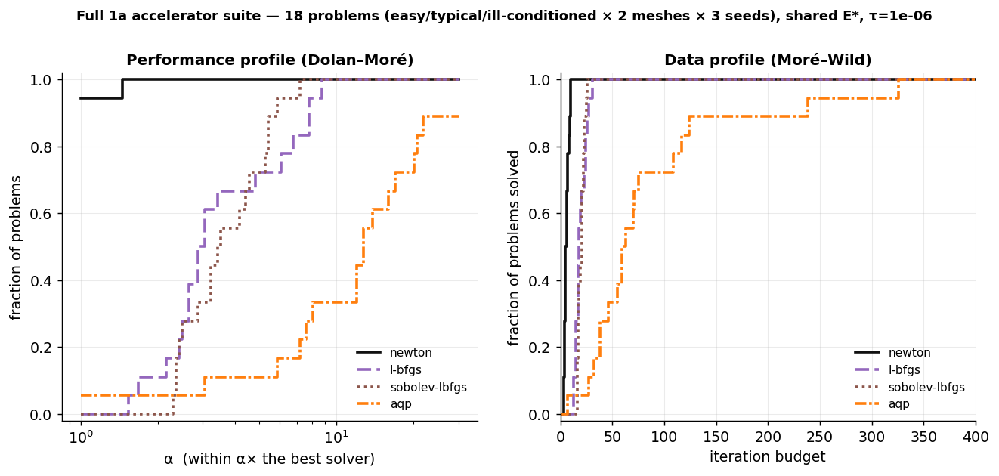

# Full 1a performance profiles — distortion accelerators (measured)

_`figures/perf_profiles_1a.png`: Dolan–Moré performance profile + Moré–Wild data profile over the whole 1a set. Generate: `python -m bench.run_figures perf_profiles_1a`._

The complete Track-1a accelerator suite on **symmetric Dirichlet** (shared energy, shared independent E* = Newton to |g|<1e-9): **newton, l-bfgs, sobolev-lbfgs, aqp**, over **18 problems** (3 strata × 2 mesh sizes × 3 seeds). Metric: iterations to the mesh-invariant normalized energy gap (E−E*)/(E0−E*) < τ. Reported as **profiles**, and **pairwise** per the Gould–Scott caveat (an N-solver performance profile is not a total order). Run: `python -m bench.run_1a_profiles`.

### τ = 0.001 — solved / 18 and median iters (where solved)

| method | solved | median iters | per-stratum solved |
|---|---|---|---|
| newton | 18/18 | 4 | easy 6/6, typi 6/6, ill- 6/6 |
| l-bfgs | 18/18 | 9 | easy 6/6, typi 6/6, ill- 6/6 |
| sobolev-lbfgs | 18/18 | 11 | easy 6/6, typi 6/6, ill- 6/6 |
| aqp | 18/18 | 12 | easy 6/6, typi 6/6, ill- 6/6 |

### τ = 1e-06 — solved / 18 and median iters (where solved)

| method | solved | median iters | per-stratum solved |
|---|---|---|---|
| newton | 18/18 | 5 | easy 6/6, typi 6/6, ill- 6/6 |
| l-bfgs | 18/18 | 18 | easy 6/6, typi 6/6, ill- 6/6 |
| sobolev-lbfgs | 18/18 | 21 | easy 6/6, typi 6/6, ill- 6/6 |
| aqp | 18/18 | 61 | easy 6/6, typi 6/6, ill- 6/6 |

### Pairwise win-fraction at τ=1e-06 (row beats column; Gould–Scott, not a total order)

| beats → | newton | l-bfgs | sobolev-lbfgs | aqp |
|---|---|---|---|---|
| **newton** | — | 100% | 100% | 94% |
| **l-bfgs** | 0% | — | 44% | 94% |
| **sobolev-lbfgs** | 0% | 50% | — | 94% |
| **aqp** | 6% | 6% | 6% | — |

## Observed (computed from this run)

- **Newton dominates on iteration count** (median 5 it at τ=1e-6; ρ(1)≈best; beats every accelerator pairwise). But that is the HW-independent count, not cost — each Newton iteration is a factorization (`e4`, `scale_cost`), so 'fewest iterations' is not 'cheapest wall-clock'.
- **At these caps and meshes every method solves all 18 problems at both τ** — so what this suite *resolves* is iteration COST; coverage separation is **not** tested here (it would need the near-inversion adversarial stratum — excluded for tractability — or larger meshes/budgets, where AQP's tail is known to stall: `mesh_independence`). On the cost axis AQP is slowest (median 12→61 it loose→tight, a **5.1×** growth vs Newton's 1.2×) and wins only 6% of pairwise matchups — the first-order tail lengthening at tight τ, visible even where coverage is saturated.
- **The Sobolev proxy is a wash POOLED but wins in its regime** — pooled it is even with plain L-BFGS (medians 21 vs 18 it, pairwise 50%/44%), because it loses on the easy/typical problems. But **within the ill-conditioned stratum it beats L-BFGS 100% of the time** — the regime-gated proxy edge, exactly as `e2`/`e3` predict. The pooled profile *hides* this regime structure; the per-stratum pairwise is what surfaces it.
- **Pairwise, not total-order.** The win-fractions are reported per Gould–Scott because a 4-solver performance profile can imply a spurious ranking; the pairwise fractions are the defensible statement of who beats whom and how often.

_Caveat: symmetric Dirichlet, 2D, dense solve, iteration-count axis (wall-clock is C++/Python-confounded, `slim`); SLIM and Anderson are excluded here because they minimize a DIFFERENT energy (reweighted-least-squares / ARAP) and cannot share this E* — they are raced separately in `slim.md` / `anderson.md`. Profiles are over iteration-count; a factorization-weighted profile would move Newton right (see `scale_cost`). Budget caps (L-BFGS 700, Sobolev 700, AQP 1200): a method exceeding its cap is 'unsolved at budget' — appropriate for a data profile, which is budget-based by construction. 3 seeds/stratum — indicative, not CI-tested._
