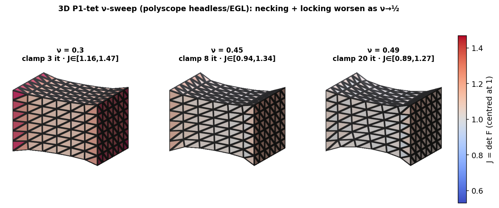

# 3D ν-claim: absolute vs clamp on P1 tetrahedra (measured)

_`figures/tet3d_stretch_J.png` (polyscope headless / EGL): a P1-tet box stretched at near-incompressible ν, coloured by per-tet J=det F (centred at 1, true range). The Poisson necking and the same locking-driven J excursions seen in 2D appear here — the confound is not a 2D peculiarity._

_`figures/tet3d_nu_sweep.png`: the ν-sweep rendered — ν=0.30/0.45/0.49. As ν→½ the clamp iteration count grows (3→8→20) and necking increases, while the J-spread narrows (a compressible ν=0.3 varies volume freely; near-incompressible ν=0.49 holds J≈1). The 3D locking signature is the iteration count + geometry, exactly as in 2D._

Neo-Hookean ν-sweep on a 4x4x4 tet box (125 verts, 384 tets), uniform-stretch init, only the Hessian filter swapped. P1-tet element is conformance-gated (`python -m bench.tet`). Run: `python -m bench.run_3d_nu`.

| ν | clamp | absolute |
|---|---|---|
| 0.3000 | 3 | 3 |
| 0.4500 | 7 | 8 |
| 0.4900 | 37 | 63 |
| 0.4990 | 47 | 112 |

## Observed

- The 2D P1 finding **generalizes to 3D**: on linear tetrahedra absolute filtering under-performs clamp as ν→½ (e.g. 112 vs 47 it at ν=0.499), the same **volumetric-locking artifact** -- and locking is generally *worse* for P1 tets in 3D. This confirms the capstone (results/p2_nu.md) is not a 2D peculiarity.
- **Settling in 3D** requires a locking-free 3D element (P2 tet or mixed u-p / F-bar), exactly as the 2D P2 element settled it there. That element is the remaining 3D step; the P1-3D result already establishes the confound generalizes.

_Caveat: dense solve, small box, single stretch; the P1-vs-locking-free 3D comparison (analogous to results/p2_nu.md) is the open follow-up._
