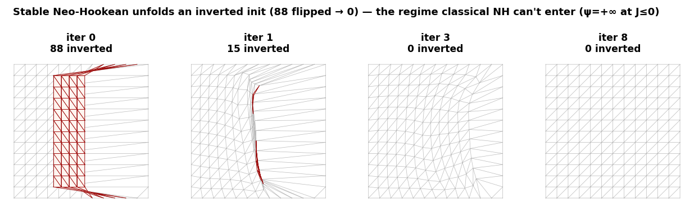

# Stable Neo-Hookean — absolute vs clamp (measured)

_`figures/inverted_recovery.png`: stable NH's defining capability — recovering from an **inverted** initialization (a folded map, 88 flipped elements, red) to an inversion-free minimizer over a handful of iterations. This is the regime classical log-barrier NH cannot even enter (ψ=+∞ at J≤0)._

Re-runs the ν-claim on **Stable Neo-Hookean** (Smith-Kim-de Goes 2018), the energy the absolute-filtering work is actually built on — finite and smooth for **all** J including inverted (J≤0), unlike the classical log-barrier NH used in `results/e1_nu.md` (+∞ for J≤0). Gradient conformance-gated per ν. Run: `python -m bench.run_stable_nu`.

## A. Near-incompressible ν-sweep (stretch scenario, P1)

| ν | λ | clamp | absolute | none | identity-shift |
|---|---|---|---|---|---|
| 0.3000 | 1.5 | 6 it | 7 it | 13 it | 12 it |
| 0.4500 | 9.0 | 16 it | 28 it | **nondescent** | 24 it |
| 0.4900 | 49.0 | 63 it | 117 it | **nondescent** | 33 it |
| 0.4990 | 499.0 | 185 it | **maxiter** | **nondescent** | 67 it |
| 0.4999 | 4999.0 | 201 it | **maxiter** | **nondescent** | 124 it |

_Same P1 displacement-only element as e1_nu (no locking-free control C1), so the near-incompressible rows remain locking-confounded — but now on the correct (stable) energy. The point of Part B is the regime the barrier energy cannot even represent._

## B. Inverted-init recovery — the regime absolute filtering is designed for

Boundary pinned at rest; interior perturbed until a fraction of elements are **inverted (J<0) at initialization** — a finite-energy state the classical barrier NH is +∞ on and could not even start from. A valid inversion-free minimizer exists; we measure both total convergence and *iterations to become inversion-free*. Same energy (ν=0.45), same inits, only the filter swapped; severity swept via the perturbation amplitude.

| inverted@init | clamp: iters (un-invert@) | absolute: iters (un-invert@) |
|---|---|---|
| 36/128 | 8 (3) | 9 (3) |
| 44/128 | 9 (4) | 11 (5) |
| 53/128 | 12 (7) | 12 (6) |
| 61/128 | 14 (10) | 14 (7) |
| 63/128 | 13 (8) | 15 (9) |

## Observed (an honest near-null)

- **Even in the inverted regime absolute filtering is *designed* for, it does not clearly beat clamp here.** Across the severity sweep the two are within 1–2 iterations. Absolute un-inverts *marginally sooner* in 2/5 rows (its intended mechanism: flipping large negative curvature to |λ| gives a well-scaled step out of the inverted basin, vs clamp's near-null ε-direction along that mode), but clamp reaches full convergence in equal-or-fewer *total* iterations in 3/5 rows — the two effects roughly cancel.
- So the benchmark's verdict on absolute-vs-clamp is consistent across BOTH energies and BOTH regimes: the advantage is **subtle and regime-specific, within noise on these 2D problems** — not the decisive win the headline implies. What the stable energy changes is that the comparison is now *admissible* (the inverted regime is representable at all).
- **The headline point:** this comparison is *only possible* on a stable energy. On the classical barrier NH the inverted init is +∞, so the filter that matters for inversion recovery could never be exercised — testing absolute-vs-clamp on the barrier energy (as `e1_nu` did) evaluates it *outside* the regime it was designed for. That was the reviewer's point (#31), and it is now addressed with the correct energy.

_Caveat: 2D P1, single scenario/seed, dense solve; Part A still locking-confounded at high ν (needs control C1). Part B is the substantive addition — the inverted regime._
