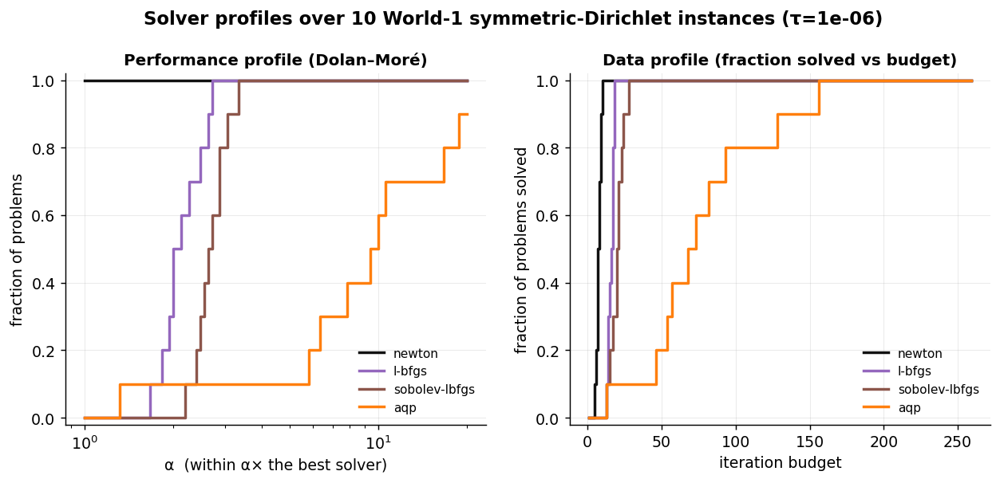

# World-1 accelerators — rigorous data profile (measured)

_`figures/profiles.png`: Dolan–Moré performance profile + a data profile over the multi-seed instance set at τ=1e-6 — the cutoff-robust comparison (no single-τ total order). Paired with the single-instance descent shapes in `figures/accelerator_convergence.png` (Newton's quadratic tail vs AQP crossing τ early then stalling)._

10 symmetric-Dirichlet instances (meshes [5, 6] × seeds 0–4). Rigor template (review-r2 #48/#49/#50/#51): **multi-seed spread**, **independent E\*** (Newton to |g|<1e-9, not best-of-compared), **τ-sweep**, and **pairwise** (not total-order) reading. Metric: iterations to `(E−E*)/(E0−E*)<τ`. Run: `python -m bench.run_world1_profiles`.

### τ = 0.001

| method | iters mean [min–max] | solved | ≤5 | ≤10 | ≤20 | ≤40 | ≤80 | ≤160 |
|---|---|---|---|---|---|---|---|---|
| newton | 6.0 [4–8] | 10/10 | 0.40 | 1.00 | 1.00 | 1.00 | 1.00 | 1.00 |
| l-bfgs | 9.1 [8–11] | 10/10 | 0.00 | 0.90 | 1.00 | 1.00 | 1.00 | 1.00 |
| sobolev-lbfgs | 12.0 [9–17] | 10/10 | 0.00 | 0.30 | 1.00 | 1.00 | 1.00 | 1.00 |
| aqp | 9.3 [5–17] | 10/10 | 0.10 | 0.70 | 1.00 | 1.00 | 1.00 | 1.00 |

### τ = 1e-06

| method | iters mean [min–max] | solved | ≤5 | ≤10 | ≤20 | ≤40 | ≤80 | ≤160 |
|---|---|---|---|---|---|---|---|---|
| newton | 7.6 [5–10] | 10/10 | 0.10 | 1.00 | 1.00 | 1.00 | 1.00 | 1.00 |
| l-bfgs | 15.9 [13–18] | 10/10 | 0.00 | 0.00 | 1.00 | 1.00 | 1.00 | 1.00 |
| sobolev-lbfgs | 20.2 [13–28] | 10/10 | 0.00 | 0.00 | 0.50 | 1.00 | 1.00 | 1.00 |
| aqp | 77.0 [13–156] | 10/10 | 0.00 | 0.00 | 0.10 | 0.10 | 0.60 | 1.00 |

## Observed (pairwise, per τ)

- **τ=0.001:** Sobolev-L-BFGS > L-BFGS (12 vs 9 it); AQP ≈ L-BFGS (9 vs 9, tie); Newton fewest iters (6) but 1 factorization/iter (see e2).
- **τ=1e-06:** Sobolev-L-BFGS > L-BFGS (20 vs 16 it); AQP > L-BFGS (77 vs 16); Newton fewest iters (8) but 1 factorization/iter (see e2).

- **τ-stability:** the Sobolev-vs-L-BFGS ordering holds at both τ. AQP's iteration count grows from τ=1e-3 to 1e-6 (9→77), the same loose-vs-tight first-order-tail effect quantified in `results/mesh_independence.md`. Rankings are stated **pairwise**, not as an N-solver total order (Gould–Scott); read the budget columns as *iterations*, not cost (a Newton iteration is a factorization, see e2).

_Caveat: 2D, dense, small meshes; independent E\* is our Newton to |g|<1e-9 (energy to ~machine precision), not a third-party oracle. Spread is min–max over instances._
